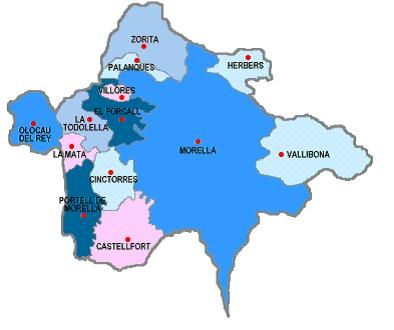
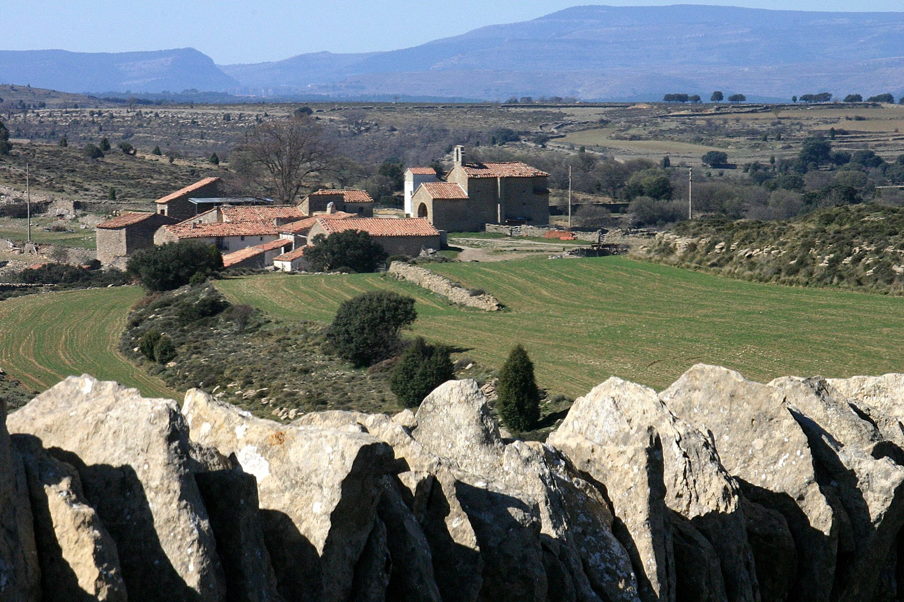
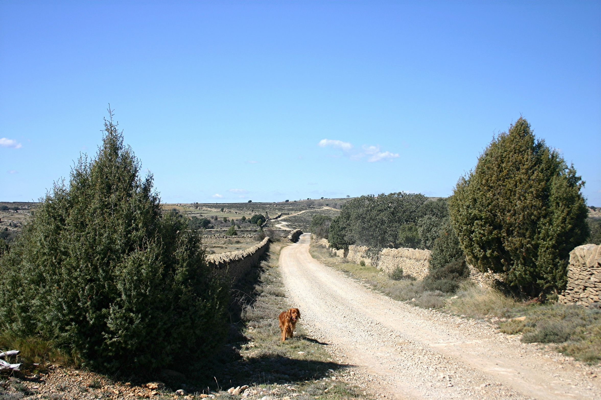

# 1. MARC GEOGRÀFIC, HIDROGRAFIA I OROGRAFIA

El terme de Morella amb els seus 383.549 Km2 és el més extens de la província de Castelló. El massís muntanyós dels Ports dóna el nom a esta comarca, sent Morella el seu capital.

“Todo el terreno son tierras amontonadas en colinas o que forman las faldas de los cerros y montes esparcidos por aquel dilatado término.” (Cavanilles 1795, tom 1, pàgina 9).

Muntanyes, moles, altiplans i valls s’alternen en el municipi, destacant les muntanyes de Carrascals (1263m.), Pinar (1081m.), Regafolet (1259m.), Morella la Vella (1068m.), Muixacre (1274m.), Fusters (1294m.) i Nevera (1286m.).

De sud-est a Nord-est el terme és travessat pel riu Bergants, alimentat per fonts i rierols. Aquest naix entre les moles de Fusters i Muixacre i seguint la direcció Nord desemboca en el riu Guadalop (Terol), entre Aiguaviva i Mas de les Mates.

El segon riu del terme és el Cérvol. Aquest riu en els seus primers quilòmetres és d’alta muntanya, naix entre dos barrancs prop de l’ermita de Sant Marc, travessa l’ombria de Cap de Riu i la del Turmell, desembocant en el Mediterrani per Vinaròs.

Les precipitacions arriben a 650 l/m² i la torrencialitat dels seus rius no és com en el clima mediterrani sinó continental. Les tempestats moltes vegades es desencadenen a la primavera i estiu, alguna vegada amb pedra que pot malmetre les collites.

Les característiques del seu relleu i l’allunyament de la costa fan que el seu clima sigui semblant al del Baix Aragó. Les temperatures al hivern oscil·len entre -3ºC i -5ºC, i a l’estiu sobre els 20ºC. Són freqüents les nevades en el nord del terme (port de Torremiró) interrompent les comunicacions per carretera a causa de les gelades

Els límits del terme municipal són al nord amb el terme de Xiva, Herbés i Torre d’Arques en la província de Terol, al sud Ares del Maestre i Catí, a l’est Castell de Cabres, Vallibona i Xert, i a l’oest Castellfort, Cinctorres, Forcall, Xiva, Palanques i Ortells.

Durant el segle XIX i principis del XX eren més de 300 les masies habitades en el seu terme i d’ací la importància que tenia el comerç dels cereals i de la llana per al desenvolupament de la ciutat.

El terme municipal de Morella es divideix en diferents partides anomenades denes. Estes denes són dotze i els seus noms són:

1. Dena de la Pobla d’Alcolea.

2. Dena dels Castellons.

3. Dena del Herbeset.

4. Dena de Font d’en Torres.

5. Dena de Morella la Vella.

6. Dena de la Roca.

7. Dena primera del Riu.

8. Dena segona del Riu.

9. Dena de la Vespa.

10. Dena de Coll i Moll.

11. Dena dels Llivis.

12. Dena del Muixacre.

Cadascuna d’aquestes denes estava composada per diverses masies i la corporació municipal de Morella nomenava entre els seus veïns un representat de l’ajuntament o *alcaldillo.*

Algunes denes van arribar a tindre escola pròpia i moltes d’elles també tenien una ermita.

Tot això permetia que hagués una gran relació social entre els habitants d'una dena.

## 1.1 La Dena dels Llivis

Esta *dena* es divideix en vint-i-una masies els noms de les quals son:

Mas de Marín, d’Adell, de Cros, dels Llivis, de la Torre Querol, de Modest, de Cardona, de Marinet, de la Torre Segura, del Planet, de Solarreta, de Julian, de l’Oronal, del Racó, de Mas Nou, de la Torre Montserrat, de la Torre Blanca, de Guardiola, de Giroveta, del Garró i d’Olivares.

La Dena dels Llivis està situada al sud-oest dins del terme municipal de Morella, encaixada entre el riu Torre Segura i la Serra Calduch d’una banda i pel mateix riu i el turó de la Llátova i la rambla de la Cana d’Ares per una altra.

La capital de la dena és la Torre Querol. Esta masia està fortificada en el centre de la dena i ubicada en un altiplà que domina tot el territori. És el lloc adequat per a realitzar actes col·lectius referents als assumptes de la dena. La seva torre es va rebaixar al nivell de la teulada del mas a mitjan segle XVIII.

L’únic riu de la dena és el Torre Segura que antigament s’anomenava Ullares. Procedeix del mont Muixacre i recorre tota la Dena dels Llivis d’est a oest per la plana fèrtil. La seva longitud és de 650 Km. i desemboca en la rambla de la Cana d’Ares.

Aquest riu és una rambla seca fins que arriba a l’Ullal de Torre Segura on es converteix en un embassament artificial que reté aigua. Després d’aquest embassament es perd el corrent per filtrar-se en la rambla fins a pocs metres de la seva desembocadura.

Quan plou el cabal és més gran però als pocs dies torna a ser una rambla amb poc aigua.

Els barrancs després de la tempestat són cabalosos. Els més importants són estos:

- Barranc de la Bellota, que desemboca en la rambla Sellumbres de Cinctorres.

- Barranc de Garró, que desemboca en el riu Torre Segura.

- Barranc de Racó, que desemboca en el riu Caldes.

- Barranc de Creus, que recorre part del mont Carrascals i també desemboca en el riu Torre Segura.

Cada masia té una o més fonts particulars i a més hi ha altres més importants pel seu cabal que són a les que acudeixen totes les masies de la *dena* quan hi ha sequera en les seves i els seus noms són: Els Ullals de Torre Segura, la de Cardona, la del Grèvol, la del Garró, la dels Llivis i la de Marín.

La dena dels Llivis és plana en tota la vega i també ho és l’altiplà que comprèn des de la Masia dels Llivis fins a la de Julian. En el seu conjunt és de pendents suaus.

A més de la Serra Calduch, que arranca de la Masia de Julian i acaba en la de Racó, està també la de Marinet, que ve del Mas de Marín i acaba en la Torre Blanca amb pronunciats pendents.

Dins del mont comú de Carrascals podem destacar el turó de la Clotxa, en el que està el punt més elevat de la dena amb els seus 1080m., el Collet de Llambroix i el Collet de la Corralisa. Les muntanes de Carrascals deuen el seu nom actual a l’abundància de la massa arbòria de carrasques o alzines però antigament s’anomenaven Na Monreala.

Per a desplaçar-se entre les masies hi ha una xarxa de camins que arriben a totes elles. A més dels assegadors que creuen per la dena, que són:

- La Sendera dels Llivis, que té una amplària de 20,89 m.

- La Colada del *Campello*, amb 15 m. d’ample.

- La Colada de *Candeales*, amb 10 m. d’ample.

- La Colada de la Cana d’Ares, amb 10 m. d’ample.

- La Colada de la Serra dels Llivis, amb 8 m. d’ample.

Les carrerades o assegadors són les vies per on té dret a transitar el ramat per a desplaçar-se d’una masia a una altra o bé per a la transhumància. Tenen distints noms segons l’amplària. La paret que les separa de les finques per on passen és inconfusible perquè té damunt la pedra alera perquè no pugui botar el bestiar als camps per on transita.

L’agricultura és de secà i a causa del tipus de terra hi ha varietat en l’explotació dels seus cultius. Quan es vivia en totes les masies es procurava tindre un xicotet hort al costat d’alguna bassa o font i així cultivar verdures de temporada en xicotetes quantitats.

Només en la marge dreta del seu riu es troben alguns horts que produeixen creïlles, llegums i també algunes vinyes. El tipus de raïm és una varietat coneguda com *vernatxa[^1]*, que dóna un vi natural de baixa graduació però de bon paladar. Encara queda en alguna masia antigues premses per a l’elaboració del vi.

La població d’aquesta dena en 1986 era de 26 persones mentre que quasi cent anys abans (cens de 1895) era de 174 persones.

[^1]: Paraula que s’utilitza en la zona per a denominar al raïm de la varietat garnatxa.
