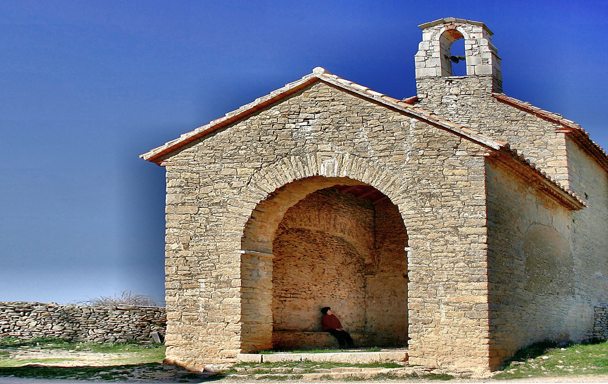
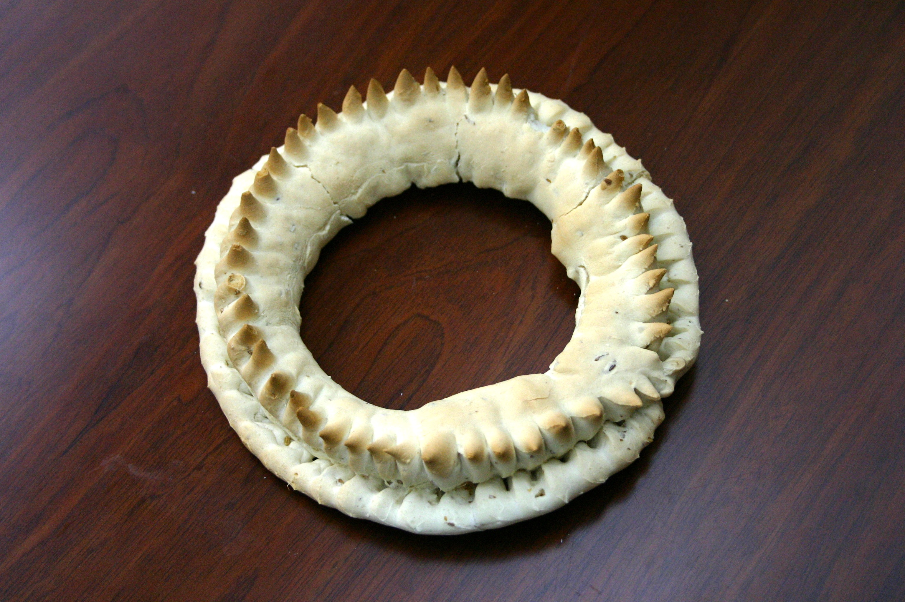

# 2. HISTÒRIA

El penyal de Morella, així com la Mola Garumba, són llocs estratègics en els que hi ha molts indicis del pas de tribus que habitaven en elles sobre l’any 2500 a. de C. S’han trobat restes de destrals de sílex, atuells i útils domèstics.

Els llocs on hi ha restes arqueològiques són diversos. En Morella la Vella hi ha pintures rupestres d’art llevantí, en la Mola de Muixacre es van trobar atuells i fonamentacions pètries, en la Vega del Moll restes d’útils domèstics, en el Mas de Beltrol monedes romanes, en el Molí del Sol i de la Vall tombes neolítiques, en el Mas de les Solanes sepultures de l’edat de bronze i en la Moleta dels Frares o de Liborio (Forcall) fonamentacions pètries, monedes i joies romanes.

Entre el Mas de Torre Querol, el Mas d’Adell i Torre Monserrat s’han trobat vestigis d’un poblat anomenat Calduch, d’ací el nom de la Serra Calduch.

Els primers grups que van viure als voltants de l’actual Morella van ser les tribus celtes Beribraces. El seu cabdill tribal Orisson va lluitar ací contra Anníbal, cabdill cartaginès, l’any 218 a. de C., i van ser derrotats, passant a formar part de la Ibercavonia Cartaginesa.

Acabades les Guerres Púniques es va fundar en la Moleta dels Frares la ciutat de Lessera, la qual cosa demostren les inscripcions trobades en Sant Antoni de la Vespa. Els ciutadans d’esta ciutat van ser part de la tribu romana Galeria, igual que els de Saguntum, Dertosa, etc.

La primera fortificació del penyal morellà va tindre lloc, segons Segura Barreda, l’any 18 a. de C., quan ja era part de l’Espanya tarragoní. Quan al Imperi Romà va arribar el cristianisme es va construir una capella al peu del que després seria el castell.

Durant anys els vàndals van arrasar les seves aldees i camps i l’any 476 el rei Urico es va apoderar de tot el territori, passant a ser domini visigot.

Més tard, durant 26 anys la comarca va ser domini Del Karem. Estos anys d’ocupació islàmica van tindre com a protagonista al Cid, que va arribar per primera vegada en 1084 quan esta terra pertanyia a la Taifa de Tortosa.

El cavaller aragonès Balasc d’Alagó, després de moltes derrotes i aliances, va conquistar Morella per al rei Jaume I, el qual va donar a Balasc d’Alagó tot el feu amb 33 pobles i es va reservar per a si Morella, les muntanyes de Vallibona i Salvassoria.

El rei Jaume I d’Aragó al donar als pobles la seva constitució política i manar que uns mateixos furs regiren en tot el regne, no va deixar de concedir algun privilegi particular a les seves viles principals segons les necessitats ho exigien.

Va concedir a València el *Tribunal dels Sequiers* (Tribunal de les aigües).

També Morella necessitava un tribunal per als bestiars, ja que llavors la seva principal riquesa era la ramaderia i contínuament s’originaven disputes quan en un descuit els pastors perdien els seus caps i es trobaven errants en les muntanyes.

Jaume I va concedir als morellans el *Tribunal del Ligalló* o dels bestiars que va deixar de funcionar a principis del segle XIX. El document de concessió (traduït del llatí) diu així:

> “Conozcan todos, como Nos Jaime, por la gracia de Dios Rey de Aragón, Valencia, etc. Por Nos y por nuestros sucesores concedemos á vosotros el Consejo de Morella, y á todos los hombres, ya de sus aldeas, como de los lugares de su término pertenecientes á órdenes y demás, el que podáis tener Ligalló, el que celebrareis en vuestro término dos veces cada año, una en el tercer día de Pentecostés, y otra en la fiesta de San Miguel de Septiembre; á cuyo Ligalló estarán obligados á presentarse los que tengan ganado apacentado en el término, ó enviar á sus pastores, presentando las reses mostrencas ó las encontradas, que no tengan dueño conocido. Y el que en tales días no concurriere al Ligalló, queda obligado á pagar y entregar á Nos ó á nuestro Bayle de Morella diez sueldos de pena. Establecemos también que el ganado mostrenco ó encontrado, que en dicho Ligalló hallare amo, le sea entregado libremente y sin impedimento. Pero si alguno ó algunos fueren convictos de haberse encontrado ganado, y lo retenían en su poder sin presentarlo, éstos serán castigados dando doble á su dueño, y á Nos ó nuestro Bayle sesenta sueldos. Pero si el ganado mostrenco, ó encontrado en los montes y presentado al Ligalló, no hallare amo, ni se supiera de quien fuese, se tendrá de manifiesto hasta la siguiente celebración del Ligalló; y cuando entonces no apareciere el verdadero amo, sea para Nos, y se pondrá en poder de nuestro Bayle, ó de su lugarteniente. Por lo mismo establecemos, queremos y concedemos á vosotros Bayle y Consejo de Morella, elijáis una persona idónea cada año, para que juzgue, recoja, observe y haga observar cuanto en esta carta se contiene; y que jure que se portará bien y fielmente. Dada en Valencia á los XVII de las Kalendas de Abril Anno Domini MCCLXX (16 de marzo de 1270).”[^1]

Balasc d’Alagó es va encarregar de la repoblació de Morella. Ell va ser qui va dictar la primera Carta Pobla de la ciutat en 1233. Les famílies que van poblar les masies i les seves terres van vindre del nord de Catalunya i les serres d’Aragó, portant els seus costums, com per exemple la de que el fill major era nomenat l’hereu i rebia totes les terres perquè d’esta forma no es dividiren (aquest tipus d’herència es va utilitzar fins a final del segle XIX i principis del XX).

Esta comarca pel seu lloc estratègic sempre ha segut ambicionada per reis i cabdills, sofrint nombroses disputes i guerres.

En 1412 va ser proclamat rei d’Aragó Ferran d’Antequera i durant el seu regnat es va declarar el Cisma d’Occident amb el què l’església es va dividir entre dos Papes, l’aragonès Pere de Luna, que es va autoproclamar com Benedicte XIII i a Roma Bonifaci X. El rei Ferran es va reunir amb el Papa Luna en Morella i amb l’ajuda de Sant Vicent Ferrer va intentar convèncer-lo perquè li cedís la seva tiara però no ho va aconseguir.

El dia 15 d’agost de 1414, el rei acompanyat del seu seguici va anar a arreplegar al Papa amb gran pompa al convent de Sant Francesc i davall pal·li van recórrer els carrers de Morella fins a l’església on es va celebrar la funció religiosa del dia de l’Assumpció de Maria Santíssima, titular de la dita església. Durant la celebració religiosa un frare el nom del qual sonava en tota Europa (Sant Vicent Ferrer) es va dirigir des del púlpit a Benedicte XIII i parlant en llatí va dir:

> “Mirad que estáis sobre la tierra para ser la ruina o la salvación de muchos. Si os obstináis en defender vuestros derechos en la tierra los cristianos no sabrán quien es el sucesor de Pedro.”\
> [^2]

Mes tard el Papa Luna es va refugiar a Peníscola fins que va morir en 1434 a l’edat de 90 anys.

El segle XVI està marcat per la sagnant Revolta de les Germanies. En el segon període de la primera Germania Morella va recolzar la causa reial. Les aldees morellanes i els llauradors van recolzar als *Agermanats* per a ajudar al que ells creien just i també per a aconseguir la seva independència. Després de la derrota dels *Agermanats*, Carles I va agrair a Morella la seva adhesió i li va concedir la Corona Ducal a l’escut de la ciutat.

Al febrer de 1691 aconsegueixen la independència, davall el pagament a la corona de 20.000 pesos, les aldees de Forcall, Catí, Vilafranca, Cinctorres, Portell, Olocau, La Mata i Vallibona.

Quan Carles IV abdicava a favor del seu fill Ferran VII Morella celebra grans festes en honor del nou rei.

En la primavera de 1809 una columna de francesos va prendre la ciutat el dia 21 de maig. Els habitants de les masies i pobles pròxims, coneixedors del terreny, van crear guerrilles que acaçaven als francesos en muntanyes i valls.

A la mort de Ferran VII en 1833, la seva filla Isabel no va ser acceptada com a reina pels partidaris de Carles de Borbó. En la comarca dels Ports als partidaris de D. Carles se’ls anomenava els malcontents. El Baró de l’Herbés va reunir milícies i va proclamar en Morella el 13 de novembre de 1833 a Carles Maria Isidre com Carles V d’Espanya.

Entre les tropes carlines va destacar un seminarista amb graduació de caporal anomenat Ramon Cabrera Grinyó, qui més tard seria cap suprem dels Carlins amb el sobrenom del tigre del Maestrat.

Quan el 27 de desembre de 1860 moria sense descendència Carles VI, el fill del seu germà, Joan, se va autoproclamar rei amb el títol de Carles VII, al qual li va presentar la seva dimissió Cabrera en 1870.

Sent rei d’Espanya Alfons XII el govern va enviar al general Martinez Campos, assestant l’últim colp als carlins en el Maestrat.

## 2.1 Les ermites

La dena dels Llivis va ser de les que més prompte es va poblar de cristians vells de la reconquista.

Per a complir amb els seus deures religiosos esta comunitat va fundar abans de 1370, en el punt conegut com Llivis, una ermita dedicada a Sant Pere màrtir.

L’any 1460 ascendien a 40 les masies que es reunien en esta ermita tots els diumenges i festes de precepte, i era necessària la presència quasi permanent d’un sacerdot de Morella per a atendre als fidels.

Al cap de tres segles com resultava xicoteta, amb el treball dels veïns i un important llegat, l’any 1705 el mestre d’obres Joan Palau va traçar un nou projecte i el va portar a terme.

La benedicció d’aquet nou temple i la primera missa es va celebrar el dia de Pasqua de Resurrecció de l’any 1741[^3].

L’ermita està construïda amb maçoneria i pedra sense polir en els angles, sent la típica construcció rural, amb contraforts en els murs laterals, fatxada amb portada de mig punt de pedra i dovelles, pòrtic i espadanya de carreus, d’un cos, amb la campana dedicada a Sant Pere màrtir, que va ser adquirida l’any 1786 pels veïns. La coberta és de dos aigües i en el ràfec de la teulada hi ha teules àrabs. El interior és d’una sola nau amb tres trams, arcs de mig punt en la nau i volta de canó que cobreix la sagristia i la nau.

La festa religiosa es celebrava el dia 29 d’abril i era costum que assistís almenys un baró de cada masia.

Després de la celebració religiosa es reunien tots els veïns amb l’*alcaldillo[^4]* per a tractar els assumptes de la dena. Ell era l’encarregat de mitjançar en els problemes relacionats amb l’agricultura, la ramaderia i la convivència.

Quan hi havia alguna orde o novetat de l’ajuntament l’*alcaldillo* ho comunicava al veí més pròxim que al seu torn feia el mateix amb un altre veí i així s’assabentaven i participaven tots en tot.

L’*alcaldillo* tenia l’obligació de guardar en sa casa l’aixovar de l’altar de l’ermita de Sant Pere dels Llivis i també havia de netejar la dita ermita per al dia en què es celebrava la cerimònia religiosa i assistir a la missa com màxima autoritat, amb el seu bastó de comandament, rebent als veïns i invitats d’altres denes. Després de la cerimònia s’obsequiava a tots els assistents amb pastes, begudes i un gran ball, que era el que més agradava a tots els joves.

També en la masia de la Torre Segura hi ha una ermita dedicada a Sant Isidre Llaurador. Esta és d’escasses dimensions (20 m2) i va ser construïda en 1670 pel propietari de la masia.

Amb el temps en les ermites de la dena ja només es celebra la missa el dia de la seva festa.

En l’ermita de Sant Pere màrtir es segueix conservant la tradició de repartir un rotllo entre els assistents després de la cerimònia, el qual reparteix el majoral d’aqueix any, que es presta de forma voluntària i quasi sempre en acció de gràcies per algun motiu particular.

La massa d’aquest rotllo és àzima, com el pa que feien els hebreus segons les escriptures. El costum és donar-lo després que el sacerdot ix al camp i beneeix les collites en els quatre punts cardinals amb aigua beneïda i usant unes branques de romer o una altra planta semblant.

[^1]: Segura Barreda: “*Morella y sus aldeas*” Tom I, pàgines 220-223.
[^2]: Segura Barreda: “*Morella y sus aldeas*” Tom IV, pàgines 157-158.
[^3]: Segura Barreda: “*Morella y sus Aldeas*” Tom I - pàgina 410.
[^4]: Castellanisme utilitzat per anomenar a la persona que representa l’autoritat en la dena.
