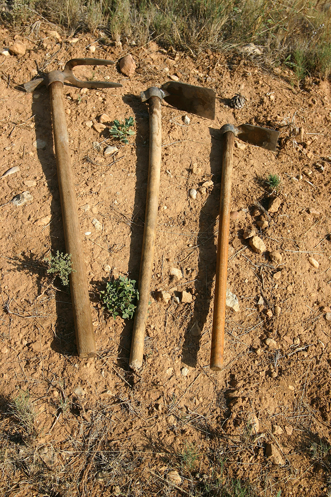
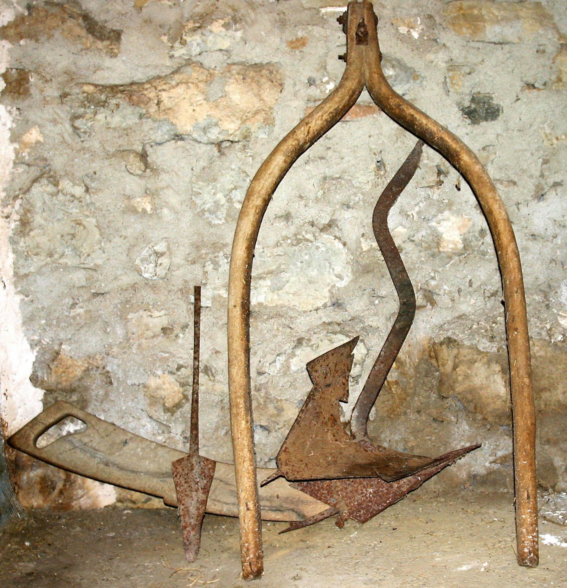
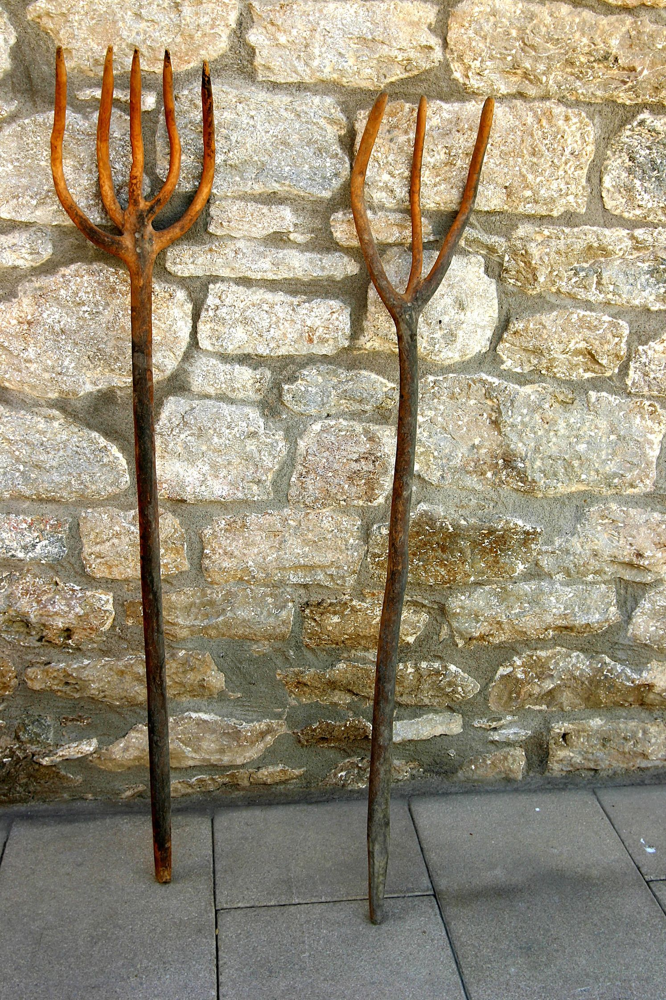
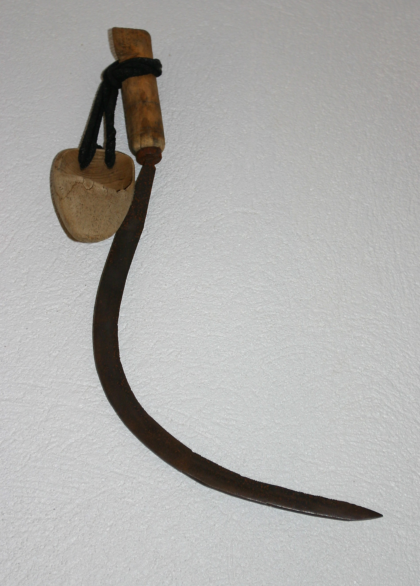
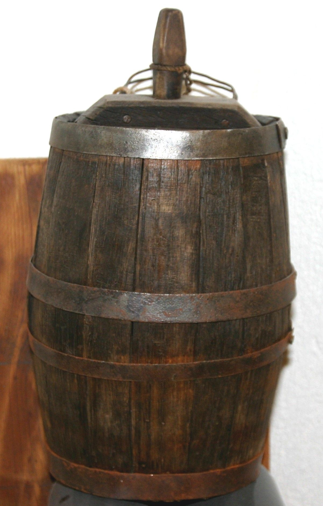
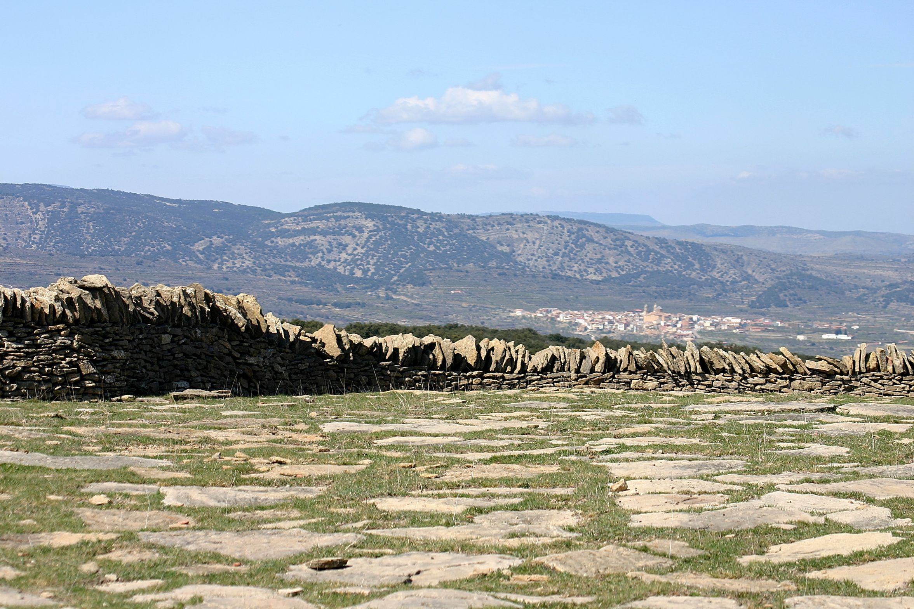

# 3. AGRICULTURA

Durant segles el camp de Morella ha tingut signe cerealista.

A finals del segle XVIII encara no es veia alterat per la presència d’altres productes, però en el segle XIX es comencen a veure cultius d’hortalisses i llegums i augmenten els camps de cultiu a causa de l’augment de població.

En el segle XX la producció segueix sent majoritàriament de blat, creïlles, llegums i gra però sense augmentar la superfície de cultiu.

A pesar de ser el terme municipal més gran de la província de Castelló, a partir de 1987 a penes es llaura un 9% de les terres. Aquest retrocés es deu a l’èxode rural que afecta sobretot al cultiu de tubercles i cereals, guanyant en extensió els pastos i farratges a causa del interès despertat per l’expansió ramadera.

## 3.1 Construcció de la terra de cultiu

Des que l’agricultura es consolida com una activitat productora d’aliments, esta operació consisteix bàsicament a preparar el terreny per a la reproducció de plantes domèstiques.

Aquest procés ha segut lent i meticulós i amb el temps ha ocasionat la desaparició de gran part dels nostres boscos i pastos.

El treball de preparar la terra és diferent en cada cultiu, però sempre es dóna:

1- Neteja del terreny: És necessari llevar totes les pedres del camp i conservar els pendents el més plans possible.

2- Reconstrucció i anivellació: Cal evitar l’erosió del camp de cultiu quan plou molt. La pluja no deu arrossegar la terra fèrtil i per a això s’han de reparar les parets quan es trenquen i fer desaigües.

Fins molt avançat el segle XX estos treballs es realitzaven de forma tradicional, basada en ferramentes que utilitzava l’home, a vegades amb l’ajuda dels animals.

## 3.2 Cavar i llaurar

Les ferramentes que els llauradors utilitzaven per a cavar la terra, remoure-la, allisar-la, etc., corresponen a les dos grans tradicions agrícoles i preindustrials: l’ús de l’aixada amb l’energia humana i el cultiu amb l’aladre en què s’aprofita la força de tracció animal.

La tecnologia agrícola del segle XIX i meitat del XX es caracteritza pel treball fet amb l’ajuda dels animals de càrrega i, algunes vegades es necessitava també el fet a mà.

El nom més conegut de la ferramenta que s’usa és l’aixada, de la que hi ha diverses formes, perquè depèn del tipus de treball que es faci i de la varietat del terreny.

L’aixada està formada per un full o làmina de ferro més o menys grossa, de forma i dimensions diverses, que té en una part un tall i en l’altra un forat on encaixa el mànec de fusta, que mesurarà des de 0’70m fins a 0’90m i forma amb el full un angle més o menys agut. El llarg d’aquest mànec varia segons la funció i la forma que es vol.

Les aixades es poden agrupar en diferents categories de la següent manera:

1- Aixada de full ample: adequada per als horts.

2- Aixada de full estret: per a terrenys durs i pedregosos.

3- Aixada de ganxo: per al secà.

4- Aixades de formes especials: per a netejar, cavar, etc. S’utilitzen en les diverses funcions de manteniment del camp.

## 3.3 L’arada o Aladre

L’arada o aladre segons el Diccionari de la llengua catalana es un instrument agrícola que permet d’obrir solcs a la terra.

L’ús de la tracció animal modifica la forma i aspectes de les labors antigues. En l’àrea on s’utilitza es remunta al moment de la domesticació o introducció dels animals, que després seran empleats en les tasques agrícoles.

Hi ha dos maneres de llaurar: l’arada asimètrica y l’arada simètrica

Mentre la primera, que té com a part activa una rella, talla la terra i la remou, la segona té com a part activa una pala, que al tallar i enfonsar-se en la terra la gira invertint la seva posició original i la tira cap als costats.

En molts casos l’arada es fabricava a casa del llaurador, encara que el ferrer li feia les peces de ferro. La fabricació i reparació li ocupava el temps mort quan plovia, perquè no podia realitzar els treballs agrícoles.

No tota la fusta era apta per a la construcció de l’aladre. Es procurava que esta fora d’alzina carrasca i alzina matacà.

## 3.4 Animals de càrrega i treball

Els animals de càrrega i treball, com el cavall, el mul, el ase, etc., són els que millor s’adapten al terreny de secà i fred.

Un ús complementari dels animals era aprofitar el fem com a abonament natural.

En la quadra o el corral era freqüent trobar el serrador o corbellot. Açò és una peça de ferro corbada, amb dents en la part còncava, que en un extrem té forma de ganxo i serveix per a penjar-lo en una anella subjecta a la paret. S’utilitzava per a tallar o serrar en trossos l’herba seca o alfals.

Quan calia manipular la palla i l’herba per als llits dels animals s’utilitzaven forques de fusta o de ferro. Però per a remoure els llits on la palla es mescla amb el fem, que després serveix com a abonament, s’utilitzava el ganxo de fem, que és com una aixada amb tres o quatre dents llargues tipus tenidor.

Per a subjectar al cavall o mul i poder aprofitar la seva força de tir es necessitava l’ús de determinats arreus. El cabestre o becada està fet de tires de cuiro entrellaçades en diferents direccions, de forma que s’adapten al cap de l’animal, i aquest conjunt de corretges s’uneixen per mitjà d’anelles. Les corretges de cada costat de la cara s’anomenen *carrilleres[^1]* i les del mig frontals. Estes tres tires van subjectes per dos tires més, una que s’encreua en el front de l’animal anomenada frontalera i una altra a l’altura del morro que es diu *morrera*, on van la serreta i la brida o ramal, que es subjecta amb sivella. Les corretges de la part superior s’uneixen en la part de darrere per les orelles.

Quan es treballava en l’era també se li posava una peça anomenada ulleres, així l’animal no es mareja quan roda el trill. Esta peça, subjecta amb una sivella, evita que caigui la becada o cabestre.

Peces complementàries són:

- La serreta: peça de metall en forma de mitja lluna, amb dents en la part còncava, que es posa sobre el nas.

- El mos: peça de ferro que va dins de la boca.

Estes dos peces s’uneixen en la base de les frontaleres per mitjà d’anelles que estes porten, i també serveixen per a subjectar la brida, així quan es tira d’esta per a dirigir-lo l’animal obeeix més i facilita la seva direcció.

El primer que es posava abans de sortir del corral era l’albardo. Aquest aparell s’adapta al llom de l’animal, està farcit de llana de les ovelles i va revestit també amb llana la part que descansa damunt del llom i de pell o cuiro la part superior. El mateix serveix com a cadira de muntar que per a portar càrrega. Per a subjectar-lo s’utilitzava la singla, que és una tira ampla que cal passar per davall del ventre i subjectar-la per l’altre costat. La tafarra és més estreta i es passa per davall de la cua, així si cal baixar per un camí inclinat es subjecta per la part de darrere. I finalment el pitral, que com indica el seu nom és una peça que se subjecta en el pit i en el cabestre, així quan puja una costa també evita que s’escorrega cap a darrere.

Si el mul o cavall havia de portar càrrega es subjectaven damunt de l’albardo altres aparells com la sàrria o el *carrejador*.

## 3.5 Millorar la terra

Un dels problemes més importants que afrontava el llaurador de la societat rural era millorar les terres de cultiu i fertilitzar-les quan feia falta. La seva forma més natural de fer-ho consistia a utilitzar el guaret, o sigui, llaurar la terra i deixar-la descansar durant un any sense collita i així cada any es sembra en camps distints i amb aquest sistema de rotació es recupera tota la terra de cultiu.

La forma més pràctica i tradicional de fer l’abonament era aprofitar el fem dels animals del bestiar, animals de corral i les bèsties de càrrega.

La brutícia normal que es feia en la quadra el llaurador l’augmentava preparant llits de palla que es mesclen amb els excrements i l’orina. Quan hi havia una bona quantitat s’apartava amb el ganxo i es deixava en un costat. Per a emmagatzemar-ho el portaven al camp on s’amuntonava en una part o es repartia per tot el camp. Més tard abans de llaurar s’igualava amb els ganxos de fem.

Segons el costum popular abans de netejar les quadres cal tindre en compte que sigui divendres i a ser possible lluna vella, perquè si es fa així mai hi ha en els corrals ni puces ni altres paràsits.

## 3.6 La sembra

Quan s’arreplegava la collita les millors llavors es guardaven per a l’any següent, algunes deixant-les damunt d’una taula perquè s’assecaren i es conservaren adequadament.

La sembra es realitzava segons les necessitats i costums. Els cereals entre octubre i novembre, les creïlles d’hort al març i lluna plena, així no es perd l’aigua quan es reguen, i si són de secà la primera quinzena de juny, el mateix que els llegums.

En els cereals la sembra *a voleí* consisteix a llançar la llavor a grapats, caminant i procurant que arribi per igual a tot el terreny. Si s’utilitzava aquest sistema el gra es portava dins d’una taleca, que és un sac que es lliga per un extrem passant-se pel coll. La mà que queda lliure agarra el gra *a* grapats i el va tirant. El braç descriu distints angles perquè arribi a tot el camp.

També hi ha una altra forma de sembrar anomenada *a xorret[^2]*. Esta manera és distinta de l’anterior. La llavor ací es deixa caure en una espècie de doll al llarg del camp que es treballa i després ho tapen amb una taula plana que arrossega la cavalleria.

Per a saber l’extensió d’una masia es calculava per les parelles d’animals de càrrega que hi havia en ella. Així per cada parella de cavalleria que es tenia es calculava sobre uns cinquanta jornals. Un jornal és l’extensió de camp que una parella d’animals de càrrega llaura en un dia, que traduït a metres quadrats són 3333m²/jornal.

## 3.7 Ferramentes de cultiu

Hi ha un conjunt de plantes que per a la seva recol·lecció s’han de segar, sigui perquè s’aprofita la canya o el gra de la planta.

Des d’antic el instrument que s’usa per a això s’anomena falç o corbella.

La falç està formada per una fulla de ferro corbada que cada vegada és més prima fins que acaba en punta. De la part més ampla també es fa estreta prolongant-se fins on s’encaixa amb un mànec de fusta, de forma circular que es subjecta bé amb la mà.

En la pràctica el segador té una distinció entre esta ferramenta i la corbella, que és més curta. *La* falç pot ser doble gran però la seva forma és molt semblant. La primera s’usa per a segar l’herba que mengen els animals i la segona per a segar els cereals.

Quan s’usen estes ferramentes és necessari portar protecció en la mà que va arreplegant les plantes. La *zoqueta[^3]* és com una espècie de guant fet d’una peça de fusta on es posen tres dits, cor, anul·lar i menut, deixant els altres dos per a subjectar les herbes o cereals. Si no es porta esta protecció és molt fàcil tallar-se en la mà, per això el segador la utilitza sempre.

La dalla és una peça que està formada per un full d’acer que mesura aproximadament uns 0’64m per 0’14m, àmplia i lleugerament corba. El tall està en la part còncava, en l’extrem posterior. La part més ampla forma com un coll pla retorçut sobre si mateix que acaba amb una anella, on s’encaixa un mànec de fusta. La mesura del mànec varia segons qui la usa, aproximadament 1’30m.

<figure class="perduda">
Il·lustració perduda en l’original
<figcaption>Dalla</figcaption></figure>

Esta ferramenta es subjecta amb les dos mans i fa un recorregut circular prop de la terra. En cada moviment talla la planta que es queda tombada en la terra. La força es fa amb la mà dreta i es sega en sentit contrari de la inclinació de la planta.

La dalla permet segar sense inclinar-se. La planta queda estesa formant fileres, per a després fer les garbes.

Un complement que sempre acompanya al segador és la pedra d’esmolar, de forma redona i allargada. Esta pedra es passa pel full quan fa falta, ja que les pedres i les irregularitats del terreny espatllen molt el full i no talla bé. A aquest tipus de sega se li anomena *a la romana*.

## 3.8 Segar

L’època de la sega era entre juny i juliol, encara que segons el temps que ha fet s’avançava o retardava.

Per a obtenir el gra encara queda molt de treball, perquè la collita que està segada en el camp cal portar-la a l’era.

Per a segar un camp es necessitava més d’una persona. Quan arribava esta època en les masies col·laboraven tots, majors i xicotets, així podien acabar prompte, ja que si es presentava una tempestat, el mateix si el gra estava en el camp o en l’era es perdia la collita i esta era el treball de tot un any, a més de la subsistència de persones i animals.

Mitja hora abans de fer-se de dia ja estaven els segadors en el camp, després d’haverse alimentat amb el *rotllo de sega* (que es feia en totes les masies quan es pastava el pa), xocolata de pastilla i una copa d’aiguardent. Aproximadament a les set i mitja del matí arribava l’agostera amb l’esmorzar. Si el camp on es segava estava prop de la casa anava amb una cistella en cada braç en les quals hi havia menjar i beguda, i si estava lluny feia el transport amb un ase. Estos viatges es feien quatre vegades al dia, a les set i mitja del matí, a les deu, a la una i sobre les cinc de la vesprada per a portar el berenar (parlant sempre d’hora solar).

El treball de l’agostera el realitzava normalment la filla major. A part de portar els aliments també havia de cuinar i passar el dia pendent dels segadors procurant que tingueren la beguda el més fresca possible. Si prop del camp hi havia alguna font o pou es submergien en ell, dins d’un poal o lligats per l’ansa, la *canterilla[^4]* amb l’aigua i el *carratellet[^5]* amb el vi, si no, es guardaven en algun buit de les parets perquè estiguessin frescos.

L’agostera era un figura imprescindible durant l’època de la sega.

Els segadors per a transportar la planta que encara estava en el camp ho feien construint les garbes. Per a açò primer es feia el vencill que són unes poques espigues que retorçudes amb la mà són com una corda per a lligar les garbes. Estes al seu torn estan formades per cinc garbelles que són feixos d’espigues que càpiguen en les mans.

Era costum sembrar un tros de camp amb sègol per a fer els vencills, perquè aquest cereal pot mesurar fins a dos metres d’alt i amb ell es poden lligar bé les garbes. Els vencills es colpejaven per a aprofitar el gra com llavor per a l’any següent.

A mesura que es feien les garbes estes quedaven en el camp formant cavallons fins que es poguessin transportar a l’era. El transport es realitzava a lloms de les cavalleries, molt de matí, així les espigues estaven fresques i no es queia el gra pel camí.

La cavalleria que feia aquest treball, a part del cabestre, portava l’albardo, i damunt d’aquest es subjectava el *carrejador*, que és un aparell on es lligaven les garbes. Aquest aparell està fet amb dos barres de fusta que mesuren sobre un metre de llarg i s’uneixen per dos travessers també de fusta.

Les garbes es lligaven d’una en una amb les espigues cap avall pel costat i damunt de l’animal i es portaven a l’era formant una garbera fins que començava la batuda.

<figure class="perduda">
Il·lustració perduda en l’original
<figcaption>Carrejador</figcaption></figure>

## 3.9 L’era

Al costat o prop del mas i en el lloc que feia més aire estava sempre l’era, que està construïda amb pedres planes posades damunt de la terra, té forma més o menys redona i mesura entre 10 i 30 metres d’amplària.

El treball de la batuda consisteix a tallar la palla molt xicoteta i separar-la del gra i així poder emmagatzemar cada producte en el seu lloc.

Per a estos menesters s’utilitzava el trill, que està construït amb una taula de fusta forta com l’alzina, té forma rectangular i la part davantera un poc més estreta i alçada. Per la part de baix té incrustades pedres de pedrenyal i trossos de ferro en forma de serra. La grandària depenia de les necessitats. La mesura més corrent era sobre un metre.

El *trill* anava subjecte a l’animal que l’havia d’arrossegar per unes cadenes o cordes que eixien d’una peça de fusta subjecta al trill per una argolla.

Per a començar a rodar el llaurador conduïa l’animal pujant damunt d’ell, quant més pes té damunt millor, o també en el centre de l’era subjectava l’animal per la brida.

Atès que s’acabava més prompte si el trill tenia pes damunt, ací és quan es divertia la canalla, era una gran sensació, era com un joc que durava fins que et cansaves i era molt divertit deixar-se caure en la palla i tornar a pujar quan el trill passava una altra vegada donant la volta.

<figure class="perduda">
Il·lustració perduda en l’original
<figcaption>Trill</figcaption></figure>

També era costum molt usual que la persona que conduïa el trill estigués cantant. Diuen que així es compassava el ritme de les cavalleries i al sentir la veu coneguda es tranquil·litzaven.

De tant en tant s’utilitzava l’assot que és un tros de cuiro trenat i unit a un mànec, que a l’esclafir en l’aire té un so que estimula l’animal sense pegar-li.

Per a remoure i voltejar la palla s’utilitzava la forca i la pala.

La forca és una ferramenta de fusta o ferro, amb diversos forcons o pues que subjecten molt bé la palla.

La pala de voltejar també és de fusta. És rectangular, un poc ovalada i lleugerament còncava cap amunt, així quan s’alça no cau el gra, només trossets de palla. Esta ferramenta s’utilitzava per a separar el gra.

Ara queda el treball de netejar de pedres i pols i separar la palla.

Per a açò és necessari el garbell que és una peça redona de poca alçada amb la base plana plena de forats, que poden ser de distintes grandàries, per on es filtra el gra i així en el garbell queda la resta.

<figure class="perduda">
Il·lustració perduda en l’original
<figcaption>Garbells</figcaption></figure>

Ja pareix que s’acaba el treball però cal netejar bé l’era amb el raspall, que està fet amb un manoll espès de branques de ginesta o una mata de botja lligada fort amb una corda.

Acabada la batuda s’havia de saber la quantitat de gra que havia eixit. Per a això es mesurava en *barselles* i després s’omplien els sacs o talegues lligant-los fort pel coll perquè no caigués res quan es transportava el gra.

La *barsella* té una capacitat de 10 Kg. Aproximadament si està rasa i de 12,5 Kg. quan està curullada.

Quan tot el gra està envasat per a guardar-lo en el graner, si aquest no està molt lluny el porten els homes carregat en l’esquena, si no les cavalleries damunt dels *carrejadors* ben lligat.

Al seu torn la palla és amuntonada en la pallissa o paller.

[^1]: Castellanisme emprat per a denominar a les galteres.
[^2]: Localisme.
[^3]: Castellanisme utilitzat en la zona per a designar l’eina de protecció per a treballar amb la falç o la corbella.
[^4]: Localisme utilitzat per a denominar la canterella.
[^5]: Localisme utilitzat per a denominar al carretell.
