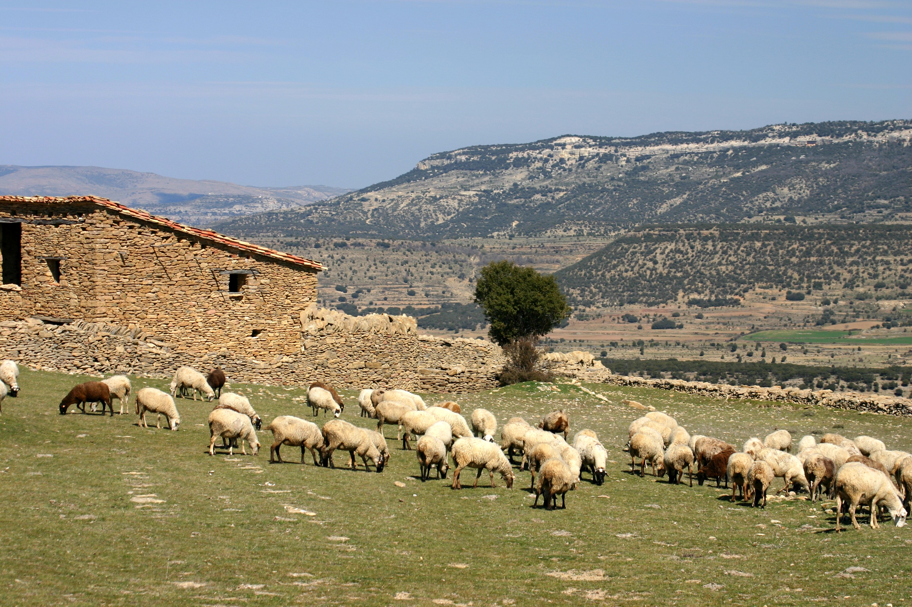
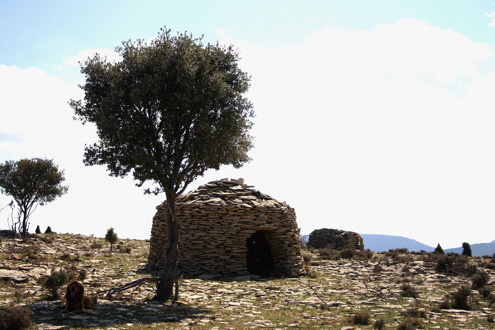
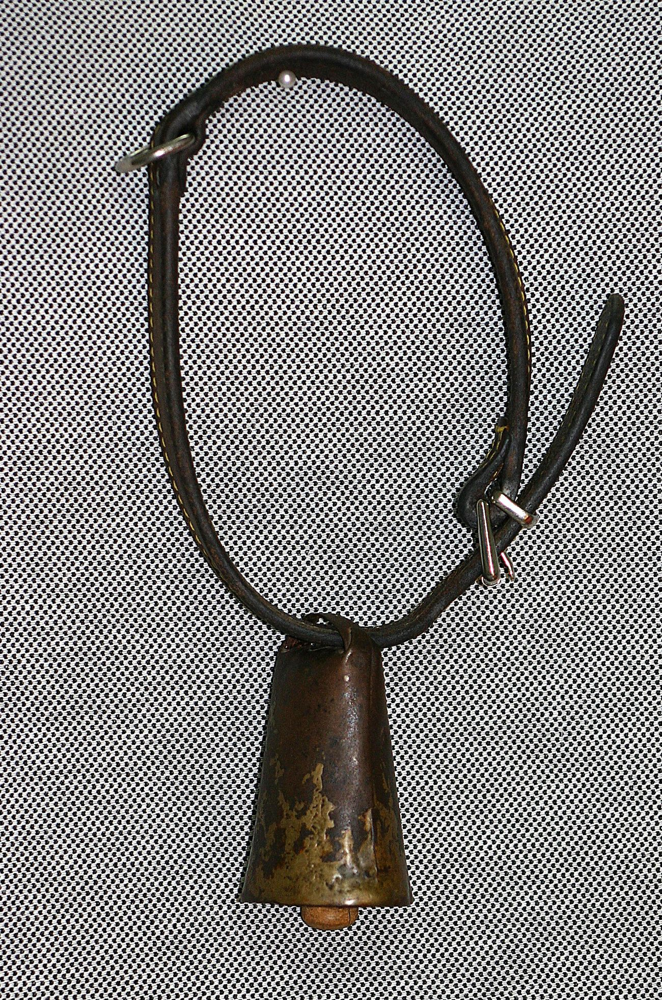
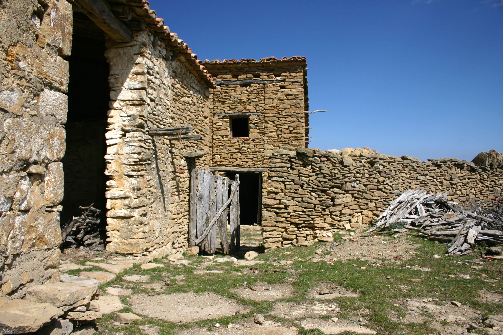
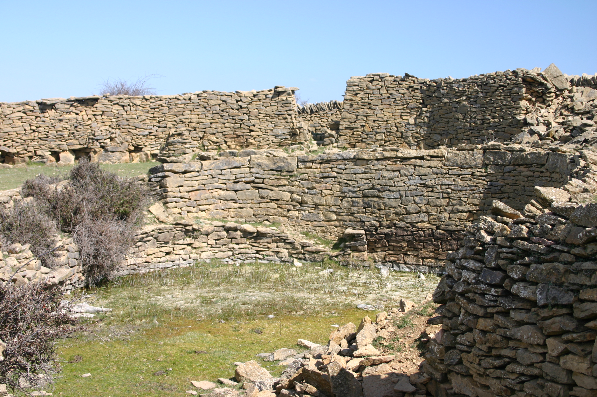

# 4. RAMADERIA

## 4.1 El ramat

Tant el bestiar oví com el cabrum que hi ha en esta comarca tenen facilitat per a adaptar-se a tot tipus de past i clima. La majoria de races procedeixen d’altres regions i ací es reprodueixen molt bé.

Des del naixement fins al deslletament, o sigui quan deixa de mamar i comença a menjar per el seu compte, la cria de la cabra s’anomena cabrit i la de l’ovella corder.

Després del deslletament i fins que apareix el zel se li anomena *xoto* o cabrit al mascle de les cabres i *xota* o cabrida a la femella. En aquest mateix període a l’ovella mascle se li diu corder i a la femella cordera.

Aproximadament a l’any cap de bestiar canvia les dents frontals o pal·les i comença a anomenar-se primal al mascle i primala a la femella, tant de l’ovella com de la cabra. Sobre esta edat l’animal té la seva primera cria i a partir d’aquest moment ja és cabra i ovella.

Quan fa la muda de les segones dents se li crida *andosc* al mascle i *andosca* a la femella, indistintament a cabres i ovelles.

Al quart any, quan canvien les penúltimes dents es criden *terserenc* i *terserenca.*

Aproximadament al quint any de vida l’animal té la dentició completa i llavors es diu que *ja ha tancat*

A partir d’aquest moment resulta molt difícil saber l’edat d’una cabra o ovella al no haver-hi signes d’evolució. Es diu llavors que l’animal *entre a vell.*

El mascle del ramat cabrum destinat a la reproducció rep el nom de *boc* i el del ramat oví *borrego.*

El conjunt de caps d’una sola espècie o mixt s’anomena rabera o ramat.

Si per algun motiu el ramat es divideix en un o més subgrups que es guarden separadament (per exemple quan se separen a les que estan prenyades de les què encara no ho estan) cada subgrup s’anomena *un tall.*

D’altra banda quan el ramat té menys quantitat de caps del que ha de tindre és una *punta de rabera.*

L’activitat de protecció i conducció del ramat es coneix com *guardar.*

Normalment, tant en ramats de cabres com d’ovelles, no és estrany que el pastor dugui uns quants caps d’una altra espècie.

Les cabres que en xicotet nombre apareixen en el ramat d’ovelles tenen funcions molt variades. Són utilitzades per a la producció de llet i formatge per al consum familiar, ja que la llet d’ovella és millor però quan la necessiten els corders és només per a ells. Després quan es venen ja es fa el formatge i el brull.

La llet de cabra també és necessària per als corders que no els vol sa mare (esta ovella s’ anomena borda) o quan tenen bessons.

La funció de les cabres també és de vegades la de conduir el ramat. Un pastor d’un mas comentava que les cabres en un ramat d’ovelles sempre les arrosseguen i van davant quan estan assentades. És en l’estiu quan està funció fa més efecte, perquè quan fa calor no es mouen ni mengen.

El ramat pot ser més gran o xicotet segons el clima i l’àrea que tenen per a pasturar. El ramat de base dels masos solia tindre entre 50 i 300 caps de bestiar.

En les masies de la plana fèrtil estan els ramats més nombrosos per ser més grans els camps de cultiu i les zones de past. Ací l’herba és millor i els ramats són més fàcils de guardar pel pastor.

Un costum molt difícil d’aconseguir és tindre en el ramat una ovella *centellera*. Diuen *els masovers* que si en el ramat hi ha una d’aquestes mai cau un raig on està ella. Aquest animal ha de ser completament de color negre i no haver sagnat mai ni amb una xicoteta arrapada, si no perd tot el poder que diuen que té.

## 4.2 El Pastor

Cuidar el bestiar no és tasca fàcil. Una bona part de l’economia del mas depenia d’aquest treball.

Si la *rabera* era molt nombrosa volia dir que la finca també era molt gran. Com en les masies sempre hi havia coses que fer, per a la guarda dels caps de bestiar es necessitava un pastor.

En altres casos aquest treball el complia, quan hi havia menys treball en l’agricultura, el propi masover o algun fill o també, si arribava el cas, un membre de la família ja major. En l’època de la sega també el feien, si feia falta, les dones de la família.

La indumentària era la mateixa que la de qualsevol home de la casa.

A l’estiu albarques fetes de goma i en temps més antic els esclops, que eren un tipus de socs, distints dels que s’usen pel nord de la península, fets de fusta de boix només la sola i la talonera i l’empenya de tires d’espart.

A l’hivern amb els calcetins de llana, que teixien les dones del mas amb la llana de les ovelles, els pantalons de pana color negre igual que la *jaca[^1]* i camisa i roba interior de cotó o llenç.

La brusa i la faixa s’han usat fins fa molt poc.

Per a tapar-se del fred o de la calor usaven barret de palla o de feltre, segons l’època de l’any, i penjada al muscle sempre la manta de pastor, que servia tant per a guardar-se del fred com de la pluja.

Esta manta també servia, amb els extrems doblegats formant una butxaca, per a transportar els corders nascuts el mateix dia en el camp i que encara no podien caminar.

Una altra peça fonamental és el sarró, confeccionat amb pell i amb una corretja. Aquest es penjava del muscle i dintre d’ell es portava tant la menjada del dia com elements que necessitava el pastor per a la guarda.

La majoria de pastors es confeccionaven ells mateixos esta peça a partir d’una pell de cabra o d’ovella, encara que la que més rendiment donava era la de cabra i encara millor si l’animal era vell ja que al ser més gran tenia més cuiro.

Una vegada es tenia la pell de l’animal el primer era adobar-la. S’estenia en el sòl i amb la mà es cobria amb una capa de sal. Després s’enrotllava i a continuació es lligava amb una corda per a evitar que es desfés. La pell estava d’esta forma penjada com a mínim tres o quatre setmanes i al final d’aquest temps ja estava totalment seca. Per a poder treballar-la era necessari que recobrés suavitat i elasticitat, i açò s’aconseguia mullant-la amb oli o llet i refregant-la amb la mà de la mateixa manera que es llava la roba. Quan ja està a punt es pot començar la confecció.

Normalment d’una peça eixia tot el cos del sarró i la tapa que el tanca. Els retalls que sobraven, tallats a tires fines i posats a remull amb aigua, s’enrotllaven posant-los damunt de la cama amb les mans per a aconseguir un tipus de fil fort amb el que es cosia la peça.

El sistema per a cosir-lo és el utilitzat pels assaonadors. Es foradava el cuiro i després a continuació es passava l’agulla amb les tires de pell convertides en un fort fil.

El pastor sempre portava en el sarró cordell, xicotetes peces de fusta, ungüents casolans, el necessari per a curar la pota trencada d’un animal si arribava el cas, una navalla i matèria primera que el pastor utilitzava durant la jornada de guarda per a *matar el temps*, com per exemple fusta per a fer culleres, formatgeres o un canó per a guardar les agulles de teixir llana. Aquest últim és un tub amb dibuixos en la fusta, quasi sempre com una greca de formes geomètriques molt boniques.

També les barraques que es veuen pels camps i serres eren construïdes pels pastors. Estes són quasi sempre de forma circular. Estan fetes amb pedres planes unes damunt d’altres, sense argamassa, fins que arriben a l’altura del sostre, a partir de la qual cada cercle de pedres sobreïx uns centímetres cap a l’interior de la construcció per a anar tancant el sostre i finalitzar-lo amb una sola pedra gran en el centre. Estes construccions a simple vista pareixen fràgils però aguanten sense caure durant anys i anys. Són un exemple d’arquitectura en sec.

## 4.3 Control del bestiar

El gos era sens dubte de gran ajuda per a la conducció i guarda del ramat.

La seva raça era una mescla i s’assemblava als que hi ha en les regions d’Aragó i Catalunya. Són animals no molt grans, llanuts, de color negre i blanc, de potes curtes i àgils, i el seu caràcter és desconfiat amb els estranys.

Perquè un gos sigui bo ha de guardar les marges del camí que creuen els camps de cultiu. A més mai fa mal a les ovelles quan les mossega si abandonen el grup, i actuen sigil·losament.

El gos està en tot moment al costat del pastor i es guia pels seus crits i gestos per a fer el que li ordena com donar-li la volta al ramat, parar-lo, assetjar a un cap o evitar que el bestiar traspassi el límit marcat. Aquest animal és el company del pastor.

Com a exemple, no fa molts anys el masover del *Mas del Frares*, que cuidava del ramat, es va resguardar d’una tempestat en una barraca i un raig que va caure el va matar a ell i a algun animal. El gos pastor es va posar de guàrdia de forma amenaçadora en la porta de la cabanya i no va deixar entrar a ningú fins que va acudir un membre de la família i se’l va emportar a la força.

## 4.4 Instruments de càstig

El garrot o bastó és molt necessari en l’equip habitual del pastor.

A part de ser un element auxiliar per a caminar, és també un punt de suport per al descans i instrument de càstig per al control del ramat.

La majoria dels pastors el fabricaven ells mateixos a partir de la branca d’un om jove.

La seva construcció és molt senzilla. Es talla la branca de la grandària de llarg necessari. Després es calfa a poc a poc amb aigua calenta o en el foc, es recolza en el sòl i en l’extrem que està calent es col·loca un tronc del diàmetre desitjat. Es manté la branca amb el peu i amb l’altra mà es força cap amunt de l’altre extrem de manera que la part calenta s’adapti a la curvatura del tronc. Aleshores es lliga amb una corda la part corba subjectant el tronc i quan està completament sec es lleva la corda i el garrot està acabat.

Un altre procediment per a castigar als corders que ocasionen problemes durant la guarda (per exemple menjar dels cultius o no seguir al ramat) és llançar pedres amb la mà. La pedra es llança amb un ràpid gir del braç des de darrere cap a davant fins a arribar a l’altura de la cintura, on surt disparada a gran velocitat.

## 4.5 Les manses y l’esquella

*Les manses* eren ovelles que sempre anaven darrere del pastor.

La seva funció era *fer punta* quan el pastor les cridava (a totes els havia posat nom) i acudien de seguida a arreplegar el seu premi, un trosset de pa o quelcom que els agradava.

Totes portaven l’esquella[^2] o esquellot. Al seu so el ramat les seguia i a més permetia saber on estaven si el pastor s’adormia o es despistava alguna punta de bestiar.

També els posaven l’esquella a les ovelles que tenien alguna cria que encara estava mamant, així el so feia que poguessin trobar a la mare.

No tots els animals portaven el mateix tipus d’esquella al coll. Si són de distinta grandària també tenen distint so, així quan el ramat es desplaçava d’un lloc a un altre el seu soroll era inconfusible.

L’esquella és una espècie de campana quasi cilíndrica que està feta de ferro o de llautó, amb un ansa xicoteta en la part superior per on passa la corretja de cuiro que la sosté i la penja al coll de l’animal. La corretja es tanca amb una sivella metàl·lica.

Dins de l’esquella hi ha un tros de cuiro del que es penja el batall, la funció del qual consisteix a colpejar els costats i produir el so. L’acústica depèn del material de què està fet. La fusta de boix o en el seu lloc un os xicotet de la canella de l’ovella és el que preferia el pastor.

La grandària de l’esquella varia segons sigui de gran l’animal que l’ha de dur.

## 4.6 Renovació del ramat.

En la primavera, quan tenien quatre o cinc mesos, els corders que no es necessitaven per a la renovació del ramat base eren venuts.

També calia vendre el caps de bestiar que eren vells.

L’absència de dents era quasi sempre el criteri que s’usava per a la separació. Un animal amb poques dents o sense elles menja amb dificultat, aprima i no pot mantenir a la seva cria.

També es renovaven aquells animals que representaven una dificultat, com les ovelles que donaven de mamar a la primera cria que se li acostava, ja que aleshores a la seva pròpia cria no li quedava llet, a les llépoles o *tunes*, que quan el pastor es distreia menjaven dels cultius que tenien prop, etc.

A l’hora de seleccionar un corder per a incorporar-lo al ramat el criteri era que fora fill d’una bona mare.

Les millors mares són aquelles que tenen molta llet. Si té molta llet el corder està ben alimentat i per tant pesa més quan es ven.

La influència del mascle per a la reproducció també era molt important. D’ací que el pastor posés molt d’interès en seleccionar-lo.

## 4.7 Corrals

Els corrals també complien funcions molt diverses.

A més de ser l’espai on s’arreplegava el bestiar, es protegia i també s’organitzava, era també el lloc on s’executaven part de les activitats productives com el munyiment. Allí eren guardats els animals malalts o difícils i sobretot es concentrava molt del fem o xerrí que es feia en el mas i que després servia com a abonament per als camps de cultiu.

Pel seu emplaçament podem distingir dos tipus bàsics:

- Els integrats en una vivenda o un altre tipus de construcció.

- Els que estan aïllats en el camp.

Els corrals integrats estaven construïts amb un mur de pedra seca de forma quadrangular, limitant una o diverses parts amb la construcció on havia segut adossat.

Les dimensions eren molt variables i estaven determinades pel nombre de caps de bestiar.

Per a permetre la circulació de l’aire a l’interior en cada tros de la paret es practicaven una espècie de ranures que també servien com a desguàs quan plovia o nevava.

En la part alta del mur, per a evitar que entrés cap animal de rapinya, es col·locaven pedres planes apegades entre si de forma vertical. Aquest tipus de mur o paret s’anomena pedra alera.

En l’interior, un altre mur de pedra amb una o dos obertures separava l’àrea coberta de la descoberta. D’esta manera els animals tenien la possibilitat d’estar entre dos ambients segons el temps que feia, a l’hivern i els dies de pluja dins i a l’estiu quan feia calor en la part descoberta.

En ocasions les obertures es tancaven amb troncs de fusta, amb la finalitat de poder realitzar determinades labors com separar els corders que encara estaven mamant quan el ramat sortia a les pastures.

## 4.8 Alimentació del bestiar

A part de la quantitat de terra de pastura era necessari i convenient aprofitar el *rastoll[^3]*, els fulls de vinya, les branques procedents de la poda dels arbres i altres productes de la neteja de la terra de cultiu, així com la vegetació que creix en el mig i els costats del camp.

El bestiar menja normalment tot tipus d’herbes que hi ha al seu abast excepte un reduït nombre de plantes verinoses entre les que cal destacar les espècies més freqüents en la zona: el matapoll i l’herba lletera. Tampoc proven els fongs verinosos, encara que tinguin molta fam.

Per contra, les plantes que més els agraden són el margall i els citrons, que són herbes que creixen al mig dels camps de cultiu.

Una part del terreny que es cultivava en les explotacions agrícoles es dedicava a produir farratge. L’extensió variava segons els animals que es tenien i la superfície de terra disponible.

La major quantitat de farratge era consumida per les bèsties de càrrega i també menjaven els animals domèstics com els porcs, conills, gallines i altres aus.

Les espècies més freqüents eren el pipirigall, l’alfals, la palla, etc. Estos eren els productes que més s’utilitzaven perquè també els donaven a les cabres i ovelles quan es necessitava en un moment determinat augmentar la ració perquè no podien eixir al camp per la neu o la pluja.

Els corders eren els que rebien major quantitat de gra quan deixaven de mamar, als tres o quatre mesos, i fins que els venien.

La sal era un complement que feia falta en l’alimentació del bestiar que té poc de past fresc. Recolzades en les parets i dins dels pessebres, posaven unes pedres grans de sal que els corders i també els animals de càrrega xuplaven molt a gust quan ells notaven que els feia falta.

## 4.9 Basses y abeuradors

Els rierols, barrancs o llacunes són els llocs naturals on beu el bestiar. Si no existien o es trobaven massa lluny del recorregut habitual del ramat, el pastor estava obligat a realitzar construccions adequades perquè pogueren beure.

Bàsicament estes construccions eren tres:

- Les basses.

- Les piques.

- Els abeuradors.

Els basses eren com a estanys fets en la terra, poc fondos, de dimensions variables, on s’arreplegava l’aigua de la pluja Aquestes devien fer-se on quan plovia era fàcil recollir l’aigua dels camins i terres més altes del mas, fent en les parets que separaven els camps obertures per on eixia l’aigua que no xuplava la terra i d’esta manera s’emmagatzemava en la bassa.

També calia tindre en compte que on es construïa la bassa la terra havia de ser argilosa, així l’aigua no es filtrava ni es perdia.

Les piques eren recipients tallats en trossos grans de pedra o fusta de diferents grandàries i formes.

En les que eren de fusta la grandària depenia del tronc triat, tant de llarg com de gros. Al buidar aquest tronc quedava un buit per a emmagatzemar l’aigua.

Estos dipòsits es col·locaven prop del pou i el pastor els omplia portant l’aigua amb un poal. Era un treball molt dur, perquè segons la quantitat de caps de bestiar es necessitava més o menys aigua i esta no es podia desaprofitar.

Els abeuradors estaven al costat de les fonts i eren també construïts perquè pogués beure el bestiar. Són semblants als que hi havia en les entrades dels pobles on anaven a beure tot tipus d’animals.

A diferència dels dos tipus anteriors ací l’aigua flueix sempre de la font i està molt neta.

## 4.10 La reproducció

L’època dels naixements era sempre quan més treball tenia el pastor.

Havia d’estar pendent de les ovelles i cabres que havien de parir per a ajudar-les en el cas que el part fora difícil i també perquè les mares llepessin bé els nounats, ja que això era un signe que els acceptaven, si no ho feien els abandonaven.

A més havien de carregar amb la cria en el braç o en la manta que porta damunt fins que pogués caminar.

En el moment de planificar la reproducció el pastor procurava que tots els naixements fossin dins del mateix temps perquè preferien vendre els corders tots al mateix temps i no escalonats.

Aproximadament als cinc mesos d’estar prenyada l’ovella o cabra comença amb els símptomes del part i a partir d’aquest moment el pastor estava alerta per si feia falta intervenir.

Si tot va bé, quinze minuts després del naixement es queia la placenta al sòl i la mare ja caminava a poc a poc amb més normalitat. Si hi havia problemes el pastor feia de veterinari i ajudava a la mare.

Des del naixement i fins als tres o quatre mesos, els animals de llet o *xotos* s’alimentaven de la mare. Passat aquest temps calia acostumar-los que deixaren de mamar i començaren a menjar per si mateixos.

## 4.11 L’esquiló

Una part dels ingressos que es sumaven a la venda de cereals i corders, entre altres coses era la llana.

Aquest treball es feia entre Maig i Juny.

Normalment el feien els esquiladors, que eren homes que treballaven per parelles i acudien a les masies quan se’ls necessitava. Tenien gran habilitat per a tirar l’ovella al sòl i llevar-li en pocs minuts tota la llana, la qual havia d’eixir tota d’una peça i se li anomenava velló. Quan més grossa era més qualitat tenia per a la seva venda i també per a fer els matalassos de llana.

## 4.12 La venda

Quan arribava l’època de vendre els corders eren els compradors els que acudien al mas a veure i comprar la mercaderia que el pastor tenia assenyalada per a vendre. Estos caps tenien entre quatre i cinc mesos. El preu es negociava a ull, valorant la raça de l’animal, el pes i també l’oferta.

Es pesaven amb una romana i es tancava el tracte amb una encaixada de mans.

A banda dels productes normals que es treien dels corders com la carn, la llana, el *xerri* per a l’agricultura i la llet amb la qual també s’elaborava el formatge, encara quedava algun producte bàsic relacionat amb el ramat com la pell d’algun cap de bestiar, que es consumia en el mas. Aquesta pell sense cap tipus de tractament s’estenia per a assecar-la a l’aire i quan estava completament seca s’emmagatzemava fins que una vegada a l’any passava el peller i arreplegava totes les que tenien. El pagament sempre era per unitat i en metàl·lic.

[^1]: Gec, peça de vestir que cobreix el tronc fins a la cintura, amb mànigues i sense faldons.
[^2]: Espècie de campana petita.
[^3]: Localisme: Rostoll, conjunt de tiges de blat, ordi, etc, que romanen arrelades a la terra després de la sega.
