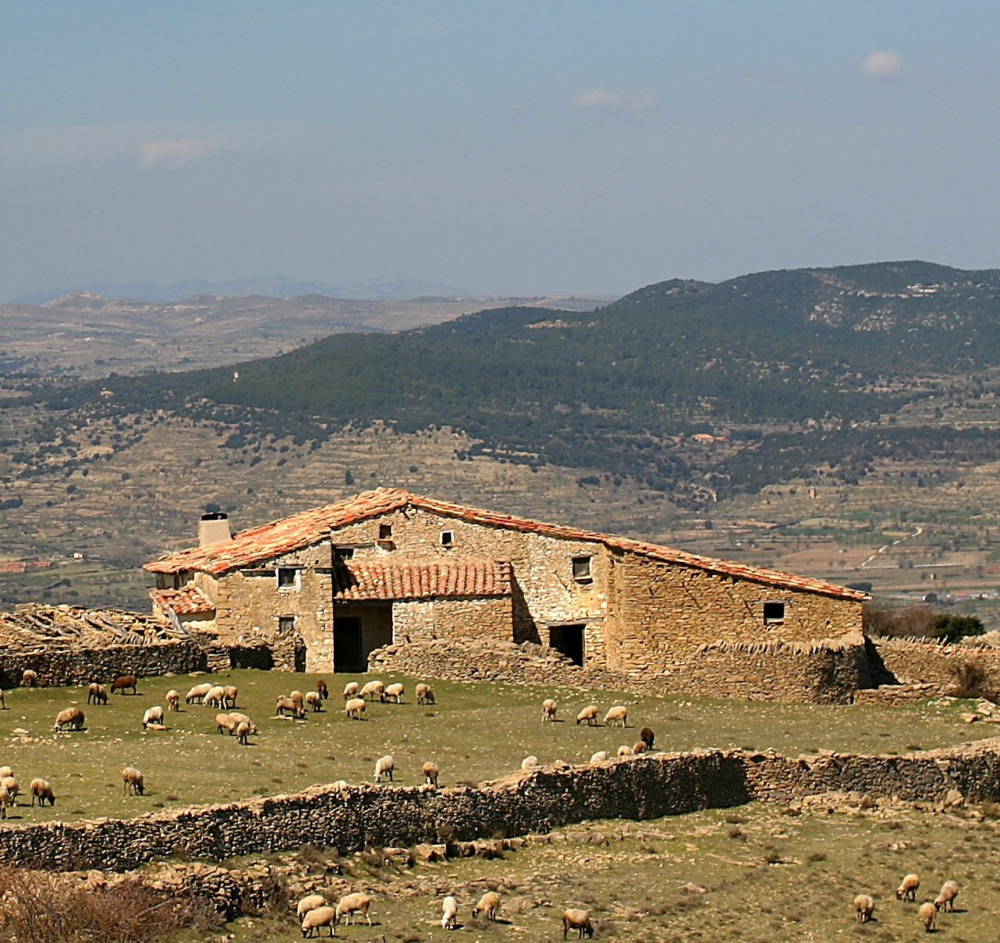
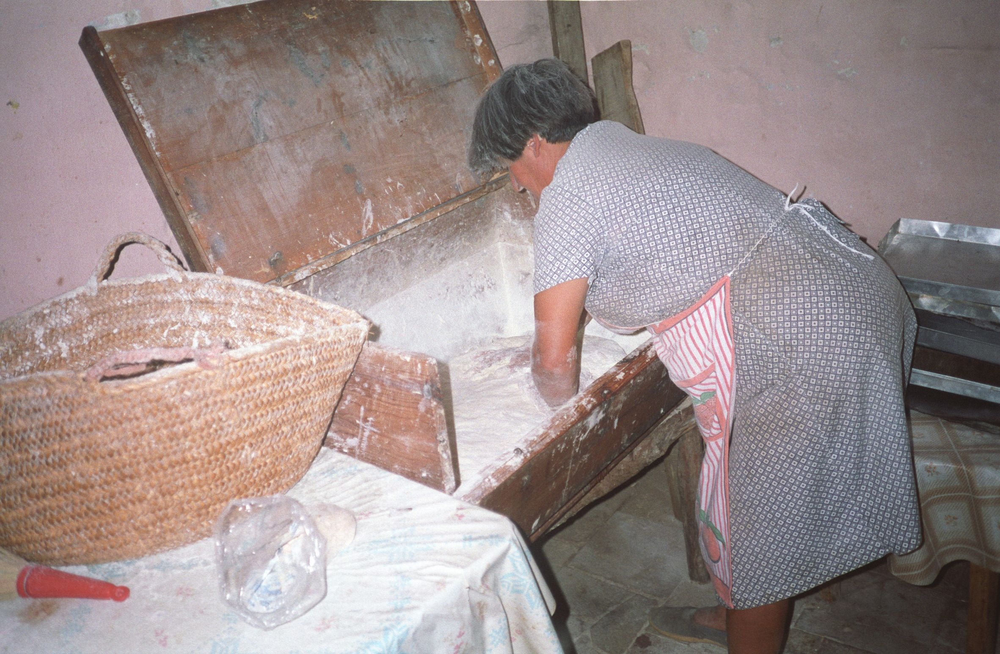
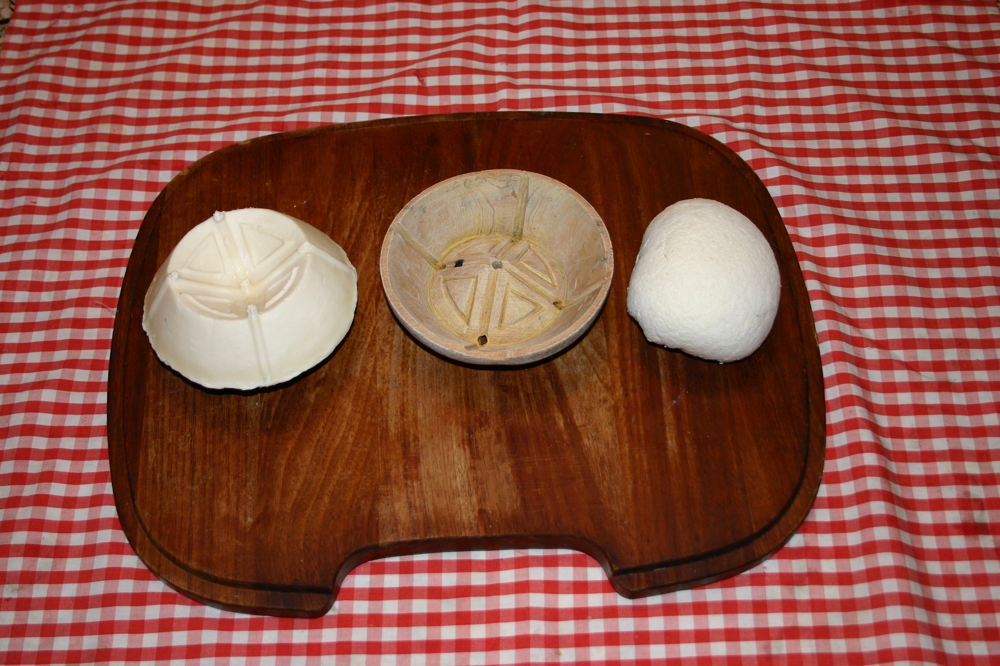
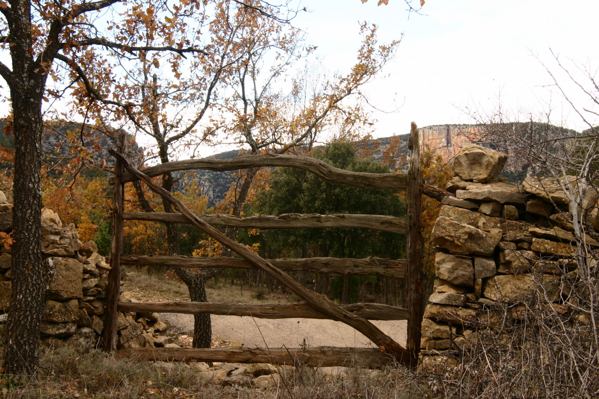
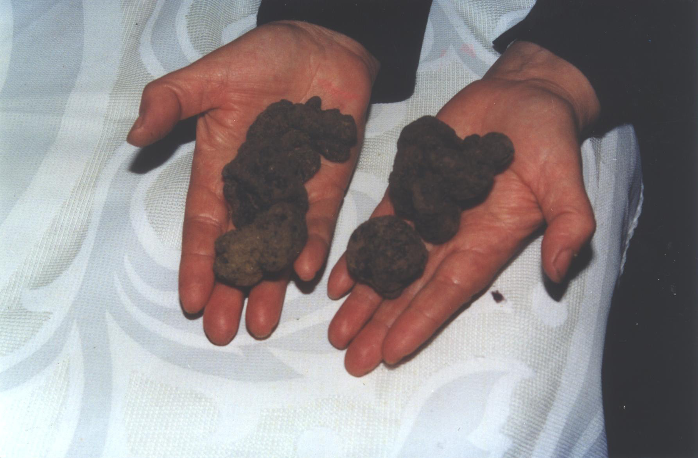

# 5. LA LLAR

## 5.1 La vivenda

Totes les masies són molt semblants. Estan construïdes amb pedra i tenen els murs molt grossos, quasi d’un metre i a vegades més. Açò és perquè a part de la seva resistència (algunes tenen cinc o sis segles d’antiguitat) les aïlla del fred i també de la calor.

Encara que la vivenda i els corrals estiguessin adossats per algun costat, les portes d’entrada de cadascun d’ells sempre estaven en costats oposats.

El que entenem com a façana sempre estava orientada cap al sud i l’oest perquè així rebia tot el sol i menys aire. Açò és important en el clima fred tant per a la casa com per a la part descoberta dels corrals. També estava al costat del mas el graner, on també es guardaven les ferramentes i els útils de cultiu.

L’orientació més freda és el nord i l’est, que sempre coincidia amb la part posterior de l’edifici. Ací només es veia alguna xicoteta finestra que hi havia en l’estada que s’usava com a assecador, és a dir, on s’emmagatzemen els productes de la matança i tot el menjar que necessitava temperatura freda i seca.

En la planta baixa de l’edifici en alguns hi havia un porxo o cobert amb un banc de pedra per a descansar, així quan plovia o nevava no entrava res en la vivenda i quan feia calor tampoc donava el sol i s’estava millor dins.

Quan s’obria la porta l’entrada és la primera estada. D’ella partia l’escala, que conduïa al pis superior, i també l’accés al celler i a totes les estades que estan adossades a l’edifici, així com als corrals, d’esta manera es podia anar a totes parts sense eixir a l’exterior.

El lloc més important de la casa era la cuina. Esta era de grans dimensions perquè en ella es desenvolupava tota la vida social de la família. Era el lloc on es rebien les visites (quan et deien “*aseu un ratet a la vora del foc*” és que eres ben rebut). Allí també es menjava ies cuinava en la llar i era el punt de reunió de tots.

A l’hivern sempre estava el foc encès tant per a cuinar com per a fer calor, a més com la llenya era abundant no hi havia problema. A la nit, quan s’anaven tots a dormir, les brases que quedaven es cobrien amb la cendra i al matí quan s’alçaven moltes vegades encara quedaven calius per a avivar el foc.

Quan hi havia alguna persona d’edat avançada el racó més acollidor al costat del foc sempre era per a ella, a part del gos i el gat, que sense saber com sempre triaven el millor lloc. Aquestos animals domèstics estaven integrats en el mas perquè eren necessaris.

El gat complia la missió de controlar als possibles ratolins que buscaven el gra, si no era així moltes vegades els sacs on es guardava la collita els mossegaven per a menjar i era un desastre.

A més del gos del pastor sempre tenien algun més per a la caça i també el que estava ensenyat per a buscar trufes.

Normalment a la cuina donen dos portes, una que dóna a la recuina i l’altra al pastador.

La recuina és el lloc que servia d’armari. En ella guardaven tots els útils de cuinar, que són molt nombrosos, com tot tipus d’olles, cassoles, paelles, totes molt fondes perquè al fregir alguna cosa no salti el menjar a la cendra*, els topins*, que són uns utensilis com una olla però més alta i més estreta, amb una sola ansa i que s’acosta al foc per la part que no la té, al costat de les brases i així pot estar molt de temps sense cremar-se el menjar.

Els plats i tota la vaixella també tenien allí el seu lloc. Les peces que s’usaven menys sempre estaven arreglades perquè es veiessin com en una vitrina. Tot això estava col·locat damunt de prestatges.

En la part baixa d’aquesta estada i en tot un costat estava el canterer, en el que com el seu nom indica es posaven els cànters, un poc inclinats, recolzats en una peça de fusta amb buits en cadascun dels quals es posava un cànter i així per a abocar l’aigua en una gerra o un altre recipient només calia inclinar-lo un poc.

En una altra paret de la recuina estava situada la pica on es rentaven els trastos amb els quals es cuinava, els plats i la resta de coses que s’utilitzaven per al menjar.

El pastador era una habitació més gran perquè, a banda de ser el lloc on es pastava el pa, era també on estava ubicat el forn, així quan es tancava la porta que donava a la cuina esta zona estava aïllada.

En el pis superior estaven els dormitoris de tota la família i també les sales on es guardava la farina, llegums i tot el menjar no perible. Per a separar les habitacions i estades les divisions estaven fetes amb barandats. Aquest tipus de construcció es realitzava subjectant canyissos pels costats amb taulers de fusta que s’unien al sòl i al sostre, després es cobria amb argamassa feta meitat i meitat amb sorra de riu i calç. Com periòdicament es pintava també amb calç aquesta paret resultava molt forta.

També està el *secador* que rep aquest nom perquè era on es guardava tot el menjar que necessitava una temperatura freda. Esta estada sempre estava orientada al cerç, que és l’aire del nord-est.

En ella es guardaven tots els productes de matança com pernils, carn salada i fumada, embotit, adob fet amb oli que es conservava en gerres de fang, i també el formatge. Tot es penjava del sostre perquè si entrava un gos o un gat es posava les bótes. També es guardaven ací els penjolls de raïm, que així es conservaven fins a Nadal, els codonys que sobraven de fer la carn de codony, el *mostillo[^1]* fet amb el most de raïm i també el *brescam* dels ruscos, l’arrop que es feia amb mel i carabassa, i molts postres més.

## 5.2 El forn

El forn de les masies era de tipus morú, fet amb pedres a mitja altura de la paret. Estes pedres havien de ser de sauló, és a dir, pedres arenoses, ja que si eren d’un altre tipus la calor les trencava i el forn no aguantava la temperatura adequada.

La boca del forn era xicoteta, el just perquè es pogués posar la llenya primer i poder netejar-lo bé al final.

El sòl era de lloses planes. En la volta eren més xicotetes per a poder donar-li la forma corba que es necessita.

Just damunt de la boca del forn sortia per la part de fora la xemeneia que pujava fins al sostre.

Per a calfar el forn es necessitava molta llenya que fes brasa perquè esta, quan ja estava calent per a coure el pa, s’aparta a un costat i així seguia emetent calor mentre durava la cocció.

## 5.3 El pa

Per a fer el pa en principi es necessitava la farina, que és el producte del blat. Aquest es portava al molí per a la seva transformació de gra en farina i es conservava en taleques.

Però la farina encara no estava prou preparada per a fer la massa perquè fins que es necessitava no es refinava i es llevava el segó, així es conservava millor i no s’atapeïa.

La farina servia també per a moltes altres coses com per a fer dolços, tot tipus de receptes culinàries i altres usos.

Per a fer el pa s’havia de tamisar i s’utilitzava la pastera, que era com un calaix de forma específica que hi havia en totes les vivendes, i en ella s’elaborava tot el procés de preparar la massa que després de diverses operacions es convertia en el pa.

El cavallet era una peça de fusta amb forma d’hac però amb dos travessers on es recolzava el sedàs. Aquest últim s’omplia de farina i es movia rítmicament dins de la pastera fins que la farina neta queia dins i el segó quedava en el sedàs. El segó després s’usava com pinso.

Aquesta operació es feia la vespra de pastar igual que la preparació del llevat, o sigui, la mare del pa que s’ha guardat de l’última massa. Aquest xicotet tros de massa fermentada calia ablanir-lo amb aigua calenta i tornar-lo a treballar amb la farina i després es guardava tapat fins a l’endemà.

Per a preparar la massa es necessitava aigua calenta amb la sal corresponent i farina.

En la pastera estava la farina i en el centre el llevat. A poc a poc s’afegia l’aigua i s’anava treballant la massa amb molt d’esforç, donant-li voltes de dalt cap avall i colpejant-la amb força. Tot açò havia de fer-se durant una hora com a mínim.

Quan la massa estava lligada s’amuntonava en una part i s’havia d’abrigar primer amb una peça de llana i després amb un llenç. Per damunt del llenç es posava una capa de segó que, a part de fer calor, a l’estona es clavillava i és el senyal que la massa està a punt per a donar la forma als pans.

Quan estaven fetes les unitats es guardaven separades pels plecs del llenç de llana i es deixaven fermentar un poc més.

A l’estona si al tocar-los es marcava el rovell dels dits ja estaven a punt.

Perquè estiguessin bé cuits, a la peça redona anomenada fogassa se li donaven quatre talls i així quedava en el centre un quadrat, i si era allargada un o dos talls transversals.

Per a posar-los dins del forn, que estava molt calent, es posava el pa damunt d’una peça de fusta allargada amb mànec anomenada pala o taulell, i d’aquesta forma es podien anar canviant les peces de lloc o traure-les sense cremar-se.

Quan els pans ja estaven cuits es guardaven dins de la pastera alineats de forma vertical i tapats.

Si hi havia prop alguna festa o celebració s’aprofitava el dia de la *fornà* per a fer pastes i coques.

## 5.4 El formatge

Les dones eren les que munyien les ovelles quan les cries o corders deixaven de mamar, als tres mesos les mares encara tenien llet i s’aprofitava per a fer formatge.

La llet del munyiment s’havia de calfar en un recipient molt net i no havia de bullir.

El quall que s’usava era molt natural, es tractava d’un producte vegetal anomenat herba colera o flor del card. A esta flor se li llevaven els filaments i es deixaven assecar per al seu posterior ús com a quall.

Per a elaborar el formatge s’havia de posar a remull el quall amb un poc d’aigua i al poc de temps es posava al morter donant colps amb la maça fins que perdia el color morat i es tornava blanc. Llavors el líquid que quedava es colava i es tirava a la llet que havia d’estar tèbia.

Segons el costum popular si era un dia que amenaçava tempestat no s’elaborava el formatge ja que encara que tot el procés se fera bé la llet no quallaria i s’espatllaria tot.

Els motlles o *fliteres* eren de fusta, fets a mà amb distints dibuixos que quasi sempre feia algun membre de la família. Eren de distints mesures i amb uns orificis en la base per on sortia el sèrum. La seva forma era inconfusible perquè només s’usava per esta comarca incloent part dels pobles que afronten la província de Terol.

Amb cura perquè no es desfaci molt s’anaven posant amb les dos mans trossos de la llet quallada en la *flitera* i, estrenyent a poc a poc però ferm es posava un tros damunt d’un altre fins que estigués sobreeixint. La forma la donava el motlle amb el dibuix que tenia. Quan havia perdut tot el sèrum que sortia pels forats se li donava la volta al formatge i es tornava a començar el mateix procés.

Segons deien els majors cal tindre gràcia, la calor que donen les mans és molt important i també ho és la concentració en el que es fa.

S’anomena sèrum a tot el líquid que s’escorria de la formatgera i que quedava en el recipient després de traure tota la llet quallada.

En aquest moment si que es posava a bullir el sèrum a poc a poc perquè no es pegués i després es colava amb un llenç, es lligaven les quatre puntes i es penjava perquè escorregués el líquid que quedava i això és el riquíssim brull. Aquest no té res a veure amb el que actualment es comercialitza.

El formatge era i segueix sent molt important en la dieta de la família ja que, una vegada orejat i sec es manté molt bé i els excedents sempre es poden vendre. No sols es menja natural, també d’altres formes com fregit a rodanxes fines en una paella.

Per a la seva conservació es dipositaven damunt d’un canyís o semblant que es penjava a una altura prudencial de les bigues del sostre de l’eixugador. No s’havien de tocar perquè no perdessin la forma i es conservaren millor.

Quan alguna peça semblava que s’enfonsés i es clavillava era perquè quan es va fer no se li va llevar tot el sèrum. No estava espatllat però havia perdut molta qualitat.

## 5.5 Labors de la llar

De l’administració de la casa s’encarregava la masovera.

Les filles des de xicotetes aprenien tots els treballs que es feien en la casa, ja que al viure aïllats s’acostumaven a solucionar tots els possibles problemes quotidians.

En la tardor s’arreplegaven els bolets. En cada tros de la masia la terra és distinta. Els *pebrassos* i els *cubealbres* es troben en els boscos d’alzines, les *gírgoles* en els bancals entre els cards, els *rubiols* creixen en les praderies i el *rovelló* en el pinar.

L’any que hi havia molta abundància, per a conservar-les es tallaven a trossos i es passaven per un fil com si fora un rosari. Després els penjaven i a poc a poc anaven perden el líquid i s’assecaven, durant així tot l’hivern.

En l’estiu després de ploure es buscaven els caragols o vaquetes per a acompanyar els guisats de conill.

La dona major de la casa era la que cuinava i distribuïa el treball de les xiques segons les seves habilitats.

El menjar de les masies, que és senzill i substanciós, té influència jueva, àrab i medieval.

Els típics flaons són de la cultura àrab, així com el torró, el coc en mel i molts més.

Una altra de les labors era el tractament de la llana de les ovelles. Esta, després de llavar-la, es filava de forma molt senzilla passant-la per la vora d’una canya a la què se li havia fet una mossa i amb l’altra mà es retorça per a formar un cabdell.

Amb esta llana es teixien grossos calcetins per a l’hivern, i també era imprescindible per a confeccionar els matalassos que elles mateixes feien després de batre-la (per a un matalàs es necessitaven vint-i-cinc o trenta quilos de llana).

De les sobres dels greixos es fa sabó per a llavar.

Antigament de forma periòdica es feia la *bugà[^2]*, de manera que es posava la roba bruta plegada dins d’un cossi i quan estava ple es cobria amb un llenç apropiat anomenat cendrer, el qual es tapava amb cendra procedent del forn ben tamisada perquè no tingués res de carbó ni sutja. Després des d’un calder s’anava tirant aigua molt calenta per

damunt de la cendra, de manera que l’aigua que es filtrava arrossegava tota la brutícia de la roba i sortia pel desguàs del *cossi*. Açò es seguia fent durant una estona fins que l’aigua que sortia es veia neta i llavors només quedava aclarir la roba.

Quan acaba l’hivern calia blanquejar amb calç les parets de la vivenda. Gran part de les labors de neteja servien també com a desinfectant, perquè a l’haver tot tipus d’animals era convenient.

Darrere de les portes del mas i dels corrals calia posar xicotetes creus fetes amb ruda per a allunyar dels perills a les persones i els animals.

També era molt bona l’alfàbega en les finestres perquè allunyava als insectes. Com a test servia qualsevol utensili, a vegades un cànter trencat o una casserola que ja no s’utilitza.

En totes les habitacions es penjaven del sostre un parell de codonys que emetien una aroma molt agradable, i entre les mantes i la roba de llana, perquè no s’arnés, es posaven unes fulles de llorer.

Dins dels armaris si es posaven unes quantes pinyes verdes mai es veia un bestiolet.

També calia recol·lectar les plantes que després de seques servien per a infusions i receptes medicinals.

Una altra tasca era el transport des dels pous o fonts de tota l’aigua que es consumia tant per a beure i cuinar com per a la neteja personal. Per a aquest menester se li posava al ase els *argadells*, que són una espècie de cistelles fetes amb una carcassa de vímet amb dos divisions en cada costat en les quals es posava un cànter i així cada viatge es portaven quatre cànters.

La il·luminació era amb cresols d’oli.

Els animals domèstics que estaven pels corrals com a conills, gallines i coloms, eren per al consum familiar i també per a vendre’ls en el poble quan s’anava cada dos o tres setmanes a comprar el que feia falta per al mas.

L’import de la venda dels ous era per a les xiques, que amb aquestos diners es compraven les seves coses.

Com les gallines estaven soltes i anaven pel camp sempre hi havia alguna que no acudia al ponedor que estava en els corrals i calia vigilar on posava els ous, de vegades en el llenyer o en qualsevol buit en les parets, si no es feia així alguna vegada apareixia la gallina lloca rodejada de pollets camí del corral (era una estampa entranyable). Tot açò ocorria perquè a l’haver-hi tants animals domèstics solts pel *mas* i pel camp, no es tenia en compte si faltava algun i la naturalesa complia la seva missió.

## 5.6 La matança

La matança a més de ser una necessitat, ja que abastia de menjar per a la primavera i l’estiu que és quan més treball hi havia, era també una celebració que reunia a familiars, amics i veïns.

Sempre es celebrava les vespres de Nadal i per a Reis d’aquesta forma tenien carn fresca per a les festes assenyalades.

Durant la matança s’apreciava la diferència de rols que hi havia entre els homes i les dones més que en cap altre treball de la masia.

La dona de més edat era qui dirigia el treball d’elles.

Al matí del dia assenyalat per a la matança els homes de la casa i els convidats desdejunaven coses típiques aquesta celebració com a pastilles de xocolata amb rotllo o pa, figues seques, ametles, panses, dolç de codony i tot tipus de pastes amb aiguardent. Després anaven a pels animals que havien de ser sacrificats, un o dos porcs i també el bou, que havien d’estar en dejú des del dia anterior. Ací començava el seu treball.

Mentrestant les dones preparaven tots els utensilis necessaris. També coïen arròs i la ceba per separat. La ceba després de cuita es deixava escórrer dins d’un sac per a seguir amb les botifarres a la vesprada. Un paper important dins de la matança el feia l’ama del mas o la filla major. La seva tasca era regirar la sang fins que estigués freda perquè no quallés, perquè sense ella no es podien fer les botifarres que es consumien al llarg de l’any seques per a l’olla i també fregides en l’adob.

Amb destresa apresa amb els anys de pràctica, els homes esquarteraven primer el porc i després el bou. Quan s’acabava de trossejar la carn el treball dels homes havia acabat, i després del dinar, que consistia en arròs amb pollastre i conill fet en cassola de fang, començava el ritual d’endevinar el pes del bou trossejat a quarts fent una aposta que guanyava el que més s’aproximava al pes que donava la romana.

Al matí les dones havien netejat els budells que es necessitaven per a l’embotit, i havien trossejat el sagí que s’usa per a les botifarres barrejant-lo amb l’arròs, la ceba picada cuita el dia anterior per a que escorregués tota l’aigua, la sang, sal, pebre negre mòlt i canella en pols.

Estes botifarres després d’embotir-les es coïen en una caldera de coure. El secret perquè no es rebentessin era no deixar que arribessin a bullir, i per a això de tant en tant es tirava aigua freda en la caldera i així coïen a poc a poc.

A les restes de la massa que sobra se li afegia farina i es feia una espècie de pilotes allargades que s’anomenaven *bolos*, les quals després tallades a rodanxes es menjaven fregides i cruixents.

Quanta més gent ajudava millor, ja que encara calia preparar la carn picada per a les llonganisses i els xoriços.

Per a les llonganisses es necessitava meitat de carn magra i meitat de cansalada amb sal, pebre negre i canella perquè donés aroma. Per als xoriços es mesclava el magre amb cansalada i s’afegia sal, orenga, pebre roig, pebre negre i alls picats en el morter i remullats amb brandi. Estes masses es deixaven en adob un o dos dies abans d’embotir-les.

Quan s’acabava amb esta tasca ja era l’hora del sopar, que consistia en sopes de *mondongo*, o sigui amb el caldo de coure les botifarres, i fregit de la matança.

Després començava el *bureo[^3]*, açò és, festa i ball que amenitzaven amb música de guitarra, bandúrria i llaüt. Aquestos instruments eren molt populars i les persones que sabien tocar-los estaven sempre convidades ja que no es concebia una matança sense *bureo.*

Aquest ritual es feia en totes les masies i com s’ajudaven els uns als altres al desembre i al gener és quan els joves més es veien i es coneixien davall la mirada atenta de les famílies.

## 5.7 Remeis casolans

Quan un membre de la família es posava malalt es buscava al metge del poble, però si no era molt greu s’usaven els remeis casolans amb cataplasmes i infusions.

Alguns d’aquestos remeis eren:

**1. Per a alleujar els colps**

**Ingredients:**

- 1 part d’ortigues[^4].
- 1 part de berbena[^5].

**Preparació:** Picar les plantes, fer una cataplasma i posar damunt del colp.

**2. Per al mal sabor de boca**

**Ingredients:**

- Brotònica[^6].

**Preparació:** Fer una infusió i prendre-la en dejú durant nou dies seguits.

**3. Per a ferides infectades**

**Ingredients:**

- Orpesa[^7].

**Preparació:** Pelar la part superior del full d’orpesa i posar damunt de la ferida cobrint-la, d’esta forma trau la infecció.

**4. Per a desinflamar furóncols**

**Ingredients:**

- Arrels de *jovenal[^8].*
- Espígol mascle[^9].

**Preparació:** Picar les arrels del *jovenal* i els fulls de l’espígol i posar-lo sobre el furóncol.

**5. Per a la hipertensió**

**Ingredients:**

- Una mica de sàlvia[^10].
- Una mica de *coscolleta[^11].*
- Una mica de *corronyer[^12].*
- Una mica de savina[^13].
- Unes fulles d’ortiga.

**Preparació:** Barrejar tots els ingredients i fer una infusió que s’ha de prendre regularment.

**6. Per a la pressió arterial descompensada**

**Ingredients:**

- Flor de pi.

**Preparació:** Fer una infusió amb la flor de pi arreplegada en el mes de Maig.

**7. Per a calmar el mal de panxa.**

**Ingredients:**

- Fonoll[^14].

**Preparació:** Fer una tisana i prendre regularment.

**8. Per a la colitis**

**Ingredients:**

- Pericó[^15].

**Preparació:** Fer una tisana i prendre per a tallar ràpidament la colitis.

**9. Para la infección de orina**

**Ingredients:**

- *Espartet[^16].*
- Cabellera de *panissa[^17].*

**Preparació:** Fer una tisana i prendre tres vegades al dia.

**10. Per al reuma**

**Ingredients:**

- Pericó.
- Oli d’oliva.

**Preparació:** Posar el pericó en oli d’oliva i deixar reposar. Després fer fregues en la zona afectada.

**11. Per al dolor de ventre**

**Ingredients:**

- 3 unces de celiandre[^18].
- 1 unça de gra de fonoll.
- 2 unces de matafaluga[^19].
- 1 unça de sucre.

**Preparació:** Posar a remulla durant una nit el celiandre. Triturar la matafaluga, el fonoll i el celiandre i barrejar amb el sucre. Després es prenen dos cullerades i s’ha de fer repòs.

## 5.8 Autosuficiència

A part de l’agricultura i de la ramaderia el masover feia moltes més coses com atendre la conservació de la masia.

Era molt important que la portera que separava els camps de les masies veïnes estigués en bones condicions perquè no es colés el bestiar a un altre mas, així com les que separaven els camps de cultiu de les zones per on passava el bestiar.

La portera té una forma molt peculiar, construïda amb branques grosses de ginebre i de savina, mesura al voltant de 1,70 m i és rectangular, amb tres o quatre travessers horitzontals units als dos troncs laterals de forma vertical. En la seva construcció no s’utilitzaven claus ni un altre tipus de metall perquè no s’oxidaren. Calia encaixar les peces de forma artesanal. Com a frontisses servien dos xicotets troncs en forma de ve i en el buit que queda després de subjectar-los entre les pedres de la paret és per on queda unida la porta d’una banda. Es pot obrir per les dos parts. Com a forrellat s’usava una simple estaca que es llevava o es posava en un buit de l’altra part de la paret.

Quan alguna tempestat espatllava les parets i es feia un portell calia tornar a empedrar i deixar-lo com abans, si no cada vegada es feia més gran i es colava per allí el bestiar als camps.

També calia mantenir els aparells dels animals de càrrega en bon estat, perquè eren necessaris per al treball en el camp, així com les ferramentes de cultiu. Açò es feia més en l’hivern quan feia mal temps.

S’havia d’abastir de llenya per al forn i el consum diari. Açò s’havia de fer tenint en compte la fase lunar. Els arbres de full caduc com el roure, el xop, el noguer, etc., sempre s’havien de tallar en lluna vella, en canvi si l’arbre no perd el full com la carrasca, es tallava en lluna nova. Si no es feia així quan es cremava la brasa feia fum i es desfeia molt prompte.

També calia netejar periòdicament les fonts i les basses on bevien els animals. Açò calia fer-ho en lluna vella, així deien que no es perdia l’aigua.

La gent del camp era molt observadora. Segons la forma dels núvols sabien si anava a ploure, nevar, si faria calor o si havia de canviar el temps. En el firmament coneixien les constel·lacions, de dia i de nit se sabien guiar mirant al cel.

Eren astrònoms, fusters, obrers, etc. Era necessari tindre noció de tots els oficis perquè tot feia falta alguna vegada i havien de ser autosuficients.

## 5.9 La trufa

La trufa és el nom vulgar dels fongs ascomicets pertanyents al gènere tuber que viuen com a paràsits, com a berrugues, sobre arrels de les alzines. Són de forma més o menys esfèrica, de color negre, quelcom gris i travessat per venes grisenques.

El tuf cabrum que a vegades emet va portar a grecs i romans a pensar que les trufes posseïen virtuts afrodisíaques. Francesc de Diego Calonge, cap de la Universitat d’investigació de micologia, en el Real Jardí Botànic de Madrid, afirma que: “*La trufa se vale de su olor para llamar la atención de los animales y hacer que estos se la coman. Debido a que sus esporas no son digestivas, las defecan y vuelven a germinar”.*

Quan els grecs van comprendre que es tractava d’un menjar exquisit van ensinistrar porcs per a localitzar-les. El porc té l’olfacte magnífic i l’olor de la trufa negra és semblant a la què emet una porca en zel a l’orinar. Però els buscadors es van adonar que els porcs amb el morro removien el terreny en excés destrossant els filaments microscòpics del fong i impedint la formació de noves trufes durant dos o tres anys. Llavors van començar a ensinistrar gossos. Qualsevol gos val per a la tasca però cal ensinistrar-lo seguint un procés. Quan el gos té fam se li permet que olori la trufa i se li dóna una mica, després se li posa el menjar. Als deu mesos el gos està preparat per a la recerca. La vespra de la recol·lecció l’animal deu dejunar. En el camp olora fins a localitzar la trufa i comença a furgar, llavors se li dóna l’alt i un poc de pa o el que més li agradi.

Amb uns ganivets especials el buscador fa un forat de no més de 15 cm. de diàmetre fins que aconsegueix la trufa. Després torna a posar la terra en la mateixa posició que estava.

La trufa és utilitzada com a guarniment en gran varietat de menjars, en xocolates, en amanides, raspada sobre carn, etc. Un d’estos fongs de la grandària d’una nou pot durar fins a un any com a condiment.

La recol·lecció comença a finals de novembre i acaba a primers de març.

En les comarques de Morella res es sabia d’això fins a 1960, any en què la gent es va adonar que uns catalans, sempre sobre la mateixa data, buscaven alguna cosa amb gossos de forma molt secreta i van començar a investigar, ja que van pensar, amb raó, que allò que buscaven havia de ser molt important.

Ara en tota la comarca es busca la trufa. En la Dena dels Llivis totes les masies que estan habitades tenen un gos ensinistrat, i en les altres quan arriba l’època també les busquen els seus amos.

El mercat és setmanal en Morella i també a Vistabella, on acudeixen els recol·lectors dels voltants. El preu varia segons l’oferta. Si no plou al final de l’estiu la collita és molt pobra.

## 5.10 La mel

La producció de mel ha segut una activitat corrent en esta comarca, igual que en tota la zona mediterrània.

Tradicionalment la mel és un substitut del sucre i com a aliment és ric en calories i vitamines.

És un complement més en la masia, a part d’una afició que es transmet de pares a fills.

La peça elemental sobre la qual es treballa és el *basso de suro* o rusc.

El lloc on es posa el rusc és necessari que estigui en una solana resguardada, a ser possible en un cingle i on sigui abundant l’herba i les flors com el romer, la lavanda, la sàlvia, el timó i el panical.

L’època de l’any en què treballen les abelles és sobretot a la primavera. Tenint en compte que les abelles treballen des que surt el sol fins que es posa, a l’hivern quasi no ixen del rusc.

En el mes de maig es comença l’arreplegada de la mel. També és el moment per a la creació de nous eixams si és convenient.

Per a acostar-se al rusc s’ha d’anar protegit i és necessari fer fum perquè se’n vagin les abelles i poder traure les bresques.

Cada tros de bresca que es trau del rusc s’oprimeix amb les mans i surt la primera mel, que es guarda en poals.

Després a casa la bresca s’ha de premsar i després filtrar tota la mel perquè quedi neta. Encara així s’ha de deixar en repòs uns dies i sempre puja a la superfície alguna impuresa que és fàcil de llevar amb una escumadora de cuina.

## 5.11 Producció de cal

La labor de fer calç no ha segut mai un ofici específic pel fet que a xicoteta escala el podia fer qualsevol segons les seves necessitats. La seva producció era una operació indispensable abans de fer alguna obra o reforma en la masia.

La utilització de la calç en la construcció està documentada en la baixa edat mitjana.

Per a fer la calç s’havia de preparar gran quantitat de llenya i de pedres. La pedra que es triava era sobretot la calcària blanca, encara que també s’usaven altres com la calcària roja, però esta és de pitjor qualitat. La pedra aconseguida es picava amb una maça procurant que quedés en trossos molt xicotets. La llenya normalment era d’argilagues, coscolls i tot tipus d’arbustos que s’arreplegaven al netejar el pinar i els camins.

El lloc adequat per a construir el forn era el límit d’un terraplè o marge, l’altura del qual depenia de la grandària que se li volia donar al forn. Aquest una vegada construït consistia en una peça buida de forma cilíndrica o cònica soterrada a l’interior del terraplè, excepte la part frontal que és on estava la boca del forn. La part superior sobreeixia un poc per damunt del nivell del marge. Les parets del forn eren de maçoneria. En la part inferior i per davall del nivell de la base del marge s’excavava un forat anomenat olla del forn, que consistia en una espècie de caldera de base redona en la qual es posaven les pedres de calç viva. Estes s’anaven posant pels costats i pujaven fins que estava coberta tota l’olla. Per a comunicar el forn amb l’exterior es construïa la boca, o sigui una espècie de finestra just on acaba l’olla, les dimensions de la qual eren les necessàries perquè una persona pogués alimentar de llenya el centre de l’olla. Damunt dels fulls de pedra viva es posaven els trossos de pedra de calç morta fins a arribar a la part més alta del marge, omplint així tot el forat. Convenia a més tapar tots els badalls i forats amb cudols i pilotes de fang.

Una vegada fet tot açò s’encenia el forn i es feia una primera cocció que servia per a temperar la pedra i durava tres dies, durant els quals es posava llenya al forn contínuament. Quan el forn estava calent i pareixia que s’anava a apagar calia separar-se uns quants metres de la boca perquè el senyal que estava preparat era que de tant en tant eixia una gran flamarada.

Després d’això calia començar a posar la major quantitat de llenya possible sense parar, el forn no es podia apagar durant el procés ni de nit ni de dia.

La forma de saber si la calç ja estava feta era observant el fum que eixia del forn i el color de la pedra. Si la pedra es veia blanca estava crua i quan tenia color daurat ja estava cuita. Quant al fum, si era de color negre calia seguir cremant i quan el seu color era blanc ja es podia llevar el foc.

El següent pas era tapar la boca del forn perquè si entrava aire la pedra es desfeia, i deixar refredar el forn durant quatre o cinc dies.

A continuació es desfeia el forn començant per la pedra morta, la qual es tirava en una bossa seca on més tard es posava aigua suficient perquè la pedra es desfés i es convertís en una espècie de caldo que era la calç que s’utilitzava per a la construcció.

Finalment es llevava la pedra viva, la qual cosa havia de fer-se en un sol dia procurant que el producte no s’airegés massa, i es guardava en pitxers o en un lloc fosc penjada i recoberta de calç morta. Esta calç és la que s’usava per a blanquejar la casa.

El forn de calç s’encenia durant el temps lliure i esta producció servia per al consum propi i per a vendre els excedents.

## 5.12 El carbó

Quan hi havia molta quantitat de llenya sobrant el masover feia un tracte amb el carboner i es repartien a parts iguals el producte final, o sigui el carbó.

L’època de tallar la llenya era a l’hivern. Sobre els tipus de llenya més adequats hi havia moltes opinions. Alguns deien que la fusta més dura com la de carrasca i alzina solia ser la millor ja que es cremava per igual i per tant hi havia un millor control per a la fabricació del carbó. Altres opinaven que si era fusta de pi el resultat era el mateix sempre que la carbonera o barraca estigués ben feta. En realitat el que comptava era el pes del carbó i de la llenya més consistent resultava un carbó més pesat. El que si es tenia molt en compte era que la llenya estigués bé seca ja que la llenya verda donava un carbó mal cremat i difícil d’encendre. Així doncs si les branques estaven verdes es deixaven assecar una bona temporada.

Una vegada triada la llenya es procedia a construir la barraca. En el centre d’una esplanada es començaven a posar troncs grossos en posició vertical, un poc inclinats cap al centre, l’altura del qual variava entre 50 cm. i un metre. En el centre es deixava un espai circular buit perquè hi haguera una xemeneia. En la base dels troncs es posaven pedres planes perquè els aïllaren de la terra, aprofitant així millor la seva combustió. Com més grossos eren els troncs més tardaven en cremar-se però el carbó era de major qualitat.

Depenent de la quantitat de llenya es construïen dos o més nivells interns de troncs, sempre en posició vertical. L’altura de cada nivell havia d’estar molt igualada i el conjunt havia de ser el més compacte possible. Si tot açò no es feia bé la carbonera corria el risc de caure.

Al final per damunt i pels costats es posava una altra capa prou grossa de branques més primes.

Quan totes estes operacions finalitzaven es recobria tot amb matolls, pels costats i per dalt, procurant que no haguera cap badall perquè no es colés després la terra que ho recobria tot excepte la part més alta on estava la boca de la xemeneia.

Per la base i fins una altura d’un pam i mig es col·locaven argelagues perquè la carbonera pogués respirar i eixiren els gasos de la secció de baix.

Si feia vent o aquest canviava bruscament de direcció calia tapar la xemeneia amb una pedra per a aconseguir el punt just de combustió. Si entrava massa aire podia ser fatal ja que si el foc s’apagava el carbó quedava cru, però encara era pitjor si l’aire alimentava massa la combustió ja que en aquest cas el carbó es convertia en cendra i es perdia totalment.

Finalment quan tota la llenya s’havia consumit es deixava reposar la carbonera durant uns tres dies. Mentrestant es llevaven les argelagues de la base i amb una llegona[^20] es removia.

Quan tot estava apagat es començava a llevar el carbó des de la part inferior amb la llegona o amb una vara de ginebre, així la barraca s’anava afonant a poc a poc cap a la base.

Tot el procés durava uns 14 o 15 dies si la carbonera no era molt gran i entre 20 i 30 dies si era major.

[^1]: Castellanisme utilitzat localment per anomenar el most.
[^2]: Bugada (localisme)
[^3]: Castellanisme utilitzat en la zona per a denominar les reunions d’entreteniment i diversió.
[^4]: Ortiga: planta de la família de les urticàcies. Urtica Diòtica.
[^5]: Berbena: planta de la família de les verbenàcies. Verbena Officinalis.
[^6]: Brotònica: planta de la família de les labiades, Betònica Officinalis.
[^7]: Orpesa: Planta de la família de les labiades espècie Sàlvia aethiopis.
[^8]: Jovenal: planta de la família de les escrofulariàcies espècie Verbascum Lychnitis i Verbascum Thapsus.
[^9]: Espígol: Planta de la família de las labiades, espècie Lavàndula Spica, aromàtica.
[^10]: Sàlvia: planta de la família de las labiades, espècie Sàlvia Officinalis.
[^11]: Coscolleta: planta de la família de las ramnàcies, espècie Rhammus Alaternus.
[^12]: Corronyer: planta silvestre de la família de las rosàcies, espècie Amelanchier Ovalis Medicus.
[^13]: Savina: arbust de la família de las cupressàcies, espècie Juníperus Savina.
[^14]: Fonoll: planta de la família de las umbel·líferes, espècie Foeniculum Officinalis, aromàtica.
[^15]: Pericó: planta de la família de las gutíferes, espècie Hypericum Perforatum L.
[^16]: Espartet: Gramínies de diferents espècies del gènere Stipa Tenacíssima.
[^17]: Conjunt de filaments que formen la flor femella del panís.
[^18]: Celiandre: planta herbàcia de la família de las umbel·líferes, espècie Coriandrum Sativum.
[^19]: Matafaluga: planta de la família de las umbel·líferes, espècie Pimpinella Anisum.
[^20]: Aixada de làmina prima, molt ampla i quasi quadrada, amb una prolongació lleugerament corbada on es col·loca el mànec i es utilitzada per a labors de l’horta i en la construcció.
