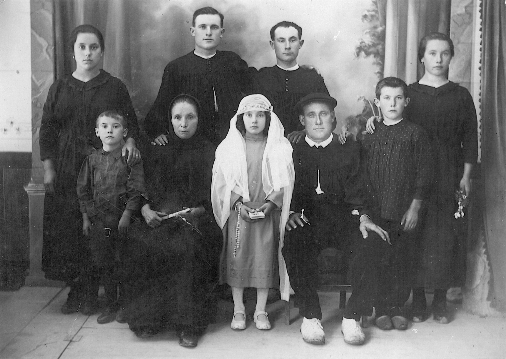
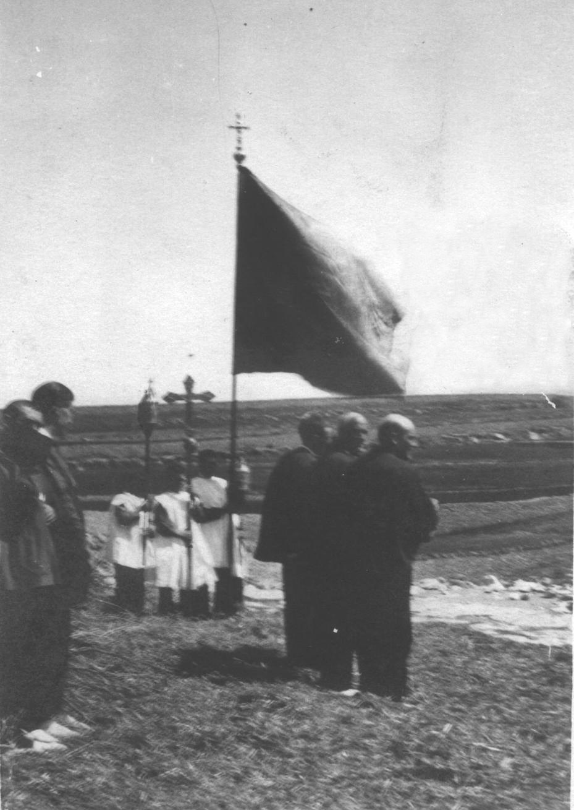
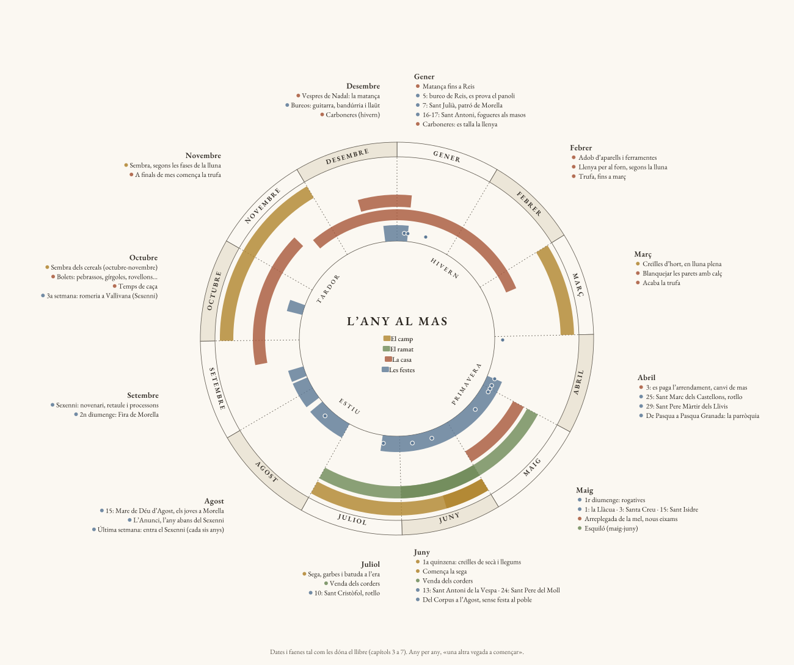

# 6. FORMA DE VIDA I COSTUMS

## 6.1 La família

La família en les masies era troncal, amb membres de fins a tres generacions.

Les terres i la casa les heretava el fill major quan contreia matrimoni i s’instal·lava en la masia junt amb els pares i germans que estaven fadrins. D’estos últims, al què no volia ser llaurador se li facilitava aprendre algun ofici que desenvolupava en el poble, i si pel contrari li agradava la vida de mas, quan formava una família es buscava una masia en arrendament i vivia en ella.

Les filles col·laboraven en els treballs de la casa i en la seva economia. Elles rebien quan es casaven l’aixovar, que consistia en els útils necessaris per a la casa, inclòs un matalàs i poc més. Si romanien fadrines eren un membre més de la família.

No era difícil de veure en qualsevol masia algun oncle major o germà dels pares integrat en tot.

Segons l’edat tots tenien les seves obligacions, xics i xiques.

Les famílies eren nombroses, amb cinc, sis o més fills.

## 6.2 L’educació

L’educació que rebien els xiquets era segons la forma de pensar del cap de família.

El costum sempre era que aprengués el fill major i per a això se li manava fora de casa perquè li ensenyaren a llegir i escriure el necessari, i després per les nits donava classe als seus germans davant de son pare.

Més tard es va decidir buscar un professor per a tots els xiquets de la dena que pagaven entre totes les masies. Les classes es donaven en l’església dels Llivis, on acudien xiquets de totes les masies caminant una hora o més.

Quan hi havia algun germà xicotet portaven un ase amb la menjada de tots i així també el pujaven a la gropa.

Es va fer així fins el dia 10 de març de 1956, que va ser creada en els Llivis pel Ministeri d’Educació Nacional, una escola unitària per a tots els xiquets de la dena. La primera mestra que va donar classe va ser Carmen Vidal Pérez.

El dia 19 de juny de 1974 es va clausurar aquest centre al crear-se el transport escolar per a alumnes d’E.G.B. a fi de planificar millor els seus estudis.

A la dena dels Llivis li va ser assenyalada com a punt de trobada per a prendre l’autobús la masia Torre Segura.

## 6.3 La cofradia

Si un masover no tenia casa pròpia en el poble acudia per a tot a la cofradia. Quan arribava deixava la seva cavalleria en els corrals i feia les seves compres, anava al metge, a la barberia, etc., i després quan acabava es tornava al mas. Aquest dret el tenien tots els masovers del terme i l’exercien quan volien.

Es desconeix la data exacta que es va fundar la Cofradia de la Santíssima Trinitat però va ser després de la conquista de Balasc d’Alagó en el segle XIII. Els seus estatuts parlen de l’existència d’un Mont de Pietat o Almodí per a atendre les necessitats dels masovers, els seus cofrades, arribant a tindre en depòsit uns 81750 Kg. de blat.

L’any 1345 es va declarar una malaltia anomenada foc del cel o pesta negra, que va atacar de forma molt violenta a persones i bestiar. Els llauradors van ser les principals víctimes. Com es deia que el mal era una epidèmia no se’ls permetia ingressar en l’hospital de malalts comuns i els masovers es van unir i van decidir la creació d’una nova cofradia davall l’advocació de Sant Antoni Abat, advocat contra la pesta, que va quedar constituïda en 1360. Cinc anys després es va comprar una casa per a convertir-la en hospital que atengués als cofrades.

Amb el temps s’ha sabut que el mal del cel no va ser una pesta sinó un enverinament o intoxicació produïda pels alcaloides que componen la fructificació d’un fong, el *Clavíceps purpúria*, que parasita els grans de les espigues de certs cereals com el sègol. Les persones emmalaltien a causa de la farina de sègol que es mesclava amb la de blat per a elaborar el pa, i els animals al menjar el gra de sègol com pinso.

El *Clavíceps purpúria* és conegut amb el nom de sègol banyut, i la falsa epidèmia o mal del cel també és coneguda com ergotisme.

En 1422 s’uneixen en el mateix lloc l’Hospital Municipal i la Cofradia.

L’any 1594 la cofradia cedeix sa casa a les monges de Sant Agustí de Biranbel per a un convent i adquireix l’actual edifici com a seu oficial. Per a ennoblir l’edifici en 1640 es col·loca l’escut en la seva porta principal.

1722 va ser un any en què la cofradia adquireix una de les capelles laterals de l’Església Arxiprestal com a centre de culte a Sant Antoni Abat.

Els cofrades decideixen construir en 1863 una capella en la Casa Cofradia en honor a Sant Antoni Abat, el seu patró, i en ella es feia la vetlla als difunts que portaven de les masies i des d’allí eixia el fèretre cap a l’església per al seu enterrament.

La confraria també tenia corrals, per a deixar els animals de càrrega en què es transportaven les mercaderies, i sales on podien menjar i descansar els masovers. Era un model de germandat i protecció mútua entre el col·lectiu agrari rural que va demostrar tindre una visió de futur res comú. Quelcom semblant a l’actual seguretat social.

En època més recent el dia 6 de novembre de 1971, la cofradia es constitueix com a associació en el Registre Oficial amb el nom de Cofradia de Llauradors Sant Antoni Abat de Morella, a l’empara de la llei de 24 de desembre de 1964, amb els mateixos fins i tradicions des de la seva fundació en 1232.

Els estatuts que fins ara han vingut complint-se són:

- La unió i auxili mutu dels llauradors del terme municipal de Morella davall el patronatge de Sant Antoni Abat.

- L’assistència hospitalària dels seus afiliats facilitant-los allotjament i habitació als que radicats en el seu terme municipal no tenen domicili en el cas urbà.

- Utilitzar el domicili social de l’associació per als enterraments i pompes fúnebres dels seus afiliats en la capella que tradicionalment usen els cofrades.

- Exaltació dels valors tradicionals i folklòrics de Morella i la seva comarca.

- Celebració de les festivitats en honor del seu patró Sant Antoni Abat.

- I també qualsevol manifestació o finalitat que fins a la data hagi realitzat esta antiga cofradia.

El domicili es fixa en el tradicionalment usat i on radica la seva seu social, Carrer de la Cofradia de Morella.

L’àmbit territorial de la cofradia es concreta en el terme municipal de Morella.

La seva junta de govern està integrada per:

- Un president.

- Vint vocals en representació de les denes a raó de dos per cada una d’elles.

- Cinc agricultors residents en el nucli urbà de la població.

- Un prior conciliari.

- Un secretari.

Tots els càrrecs són gratuïts, obligatoris i reelegibles. La seva duració a excepció del prior conciliari serà de quatre anys, renovant-se per la seva meitat cada dos anys.

## 6.4 Costums

La majoria dels habitants de les masies només acudien a la parròquia de Morella quan era necessari per algun esdeveniment de tipus religiós, però seguien el costum d’acudir a l’església entre els cinquanta dies que hi ha des de Pasqua de Resurrecció i Pasqua Granada, a complir amb parròquia. Açò ho tenien com deure.

Les relacions entre els veïns eren bones encara que la distància entre les masies fora gran. En casos d’urgència tots coneixien el costum de com demanar auxili. Quan hi havia un malalt en el mas es posava un llençol blanc en la finestra de forma visible i si era un difunt es col·locava un gran drap negre, d’esta forma es veia des de lluny i tots sabien que en aquest mas es necessitava ajuda.

Quan hi havia alguna mort entre els habitants de la masia era costum que aquella nit tots els veïns acompanyaren als familiars en la vetlla resant el rosari. A l’alba els oferien un lleuger esmorzar i al matí posaven el fèretre a lloms d’una cavalleria de càrrega per a portar-lo a Morella.

A l’animal l’havia de guiar de la brida un xiquet o xiqueta, no havia de portar-lo una persona major. Quan parlava amb la meua cosina L. Julian Orti d’aquest tema em va dir: “*Jo vaig guiar el cavall amb el nostre avi difunt fins a Morella quan era xicoteta, i ens va costar tres hores arribar fins al poble*”.

En les zones rurals les estacions de l’any marcaven tota la vida. El llaurador que no tenia masia pròpia i vivia d’arrendatari, el dia 3 d’abril era la data en què pagava a l’amo del mas de la forma convinguda. També aquest dia era l’indicat per a canviar de masia. Diuen que açò s’ha fet així des de temps antics perquè esta és l’època amb menys treball en el camp, els cereals encara no estan madurs i els llegums i creïlles encara és prompte per a sembrar-les.

Els joves acudien al poble a *fer festa* cada dos setmanes, tant els xics com les xiques. Estaven allí tot el diumenge, feien les seves compres en la plaça, anaven a sentir missa i a la tarda nit després del ball es tornaven al mas fins després de quinze dies. Açò es feia així tot l’any excepte el temps de segar i arreplegar la collita que coincidia amb el període des de la festa del Corpus fins a la Mare de Déu d’Agost, dia en el qual tots els joves acudien a Morella amb les seves millors gales.

Els últims dies d’abril comencen les romeries en les ermites que hi ha en totes les denes.

Al juny i juliol es venien els corders i s’arreplegava la collita.

A la tardor es sembrava i es tenia sempre en compte les fases de la lluna. Arribava el temps de caça, les matances, els *bureos* i una altra vegada a començar.

