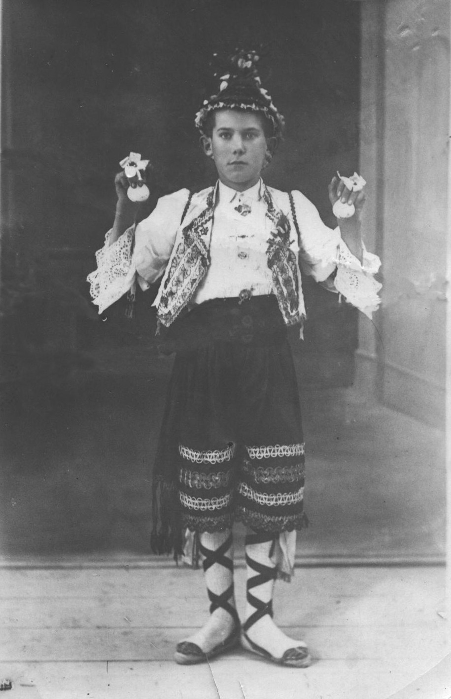
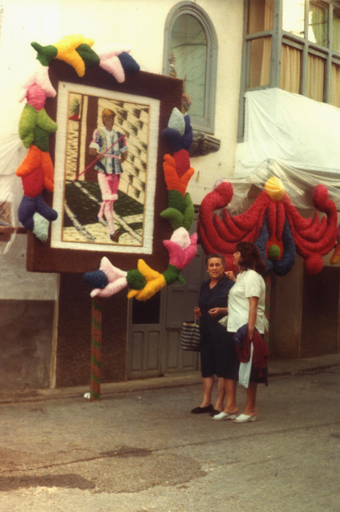

# 7. CICLE ANUAL DE FESTES

Es impensable parlar de les festes de Morella sense la presència dels masovers.

Entre les moltes celebracions de la ciutat destaquen les de Sant Antoni, el Sexenni i la Fira. En elles ells llauradors tenen gran participació, al igual que en les festes que es celebren en cadascuna de les denes.

## 7.1 Celebracions en les denes

Segons la advocació de cada ermita la seva festa es celebra en diferents dates. En aquest tipus de festes es reuneixen tots els veïns de la dena, el seus familiars i amics d’altres llocs.

La costum de repartir rotllo o panoli després de la missa i de la benedicció dels camps, és en memòria del pa beneït que es donava antigament als assistents.

El dia 25 d’abril el vot[^1] de l’ermita de Sant Marc reparteix rotllo en la dena de Castellons.

La festa de Sant Pere Màrtir dels Llivis es celebra el dia 29 d’abril. En ella es reparteix rotllo i també te vot.

El dia 1 de maig, en la aldea de la Llacua es celebra la festa dels apòstols Santiago el Menor i Felip. També es dona rotllo i te vot.

El 3 de Maig es dona rotllo en el peiró de Santa Creu del riu de les Corses, dena de Font d’en Torres. Te vot.

El dia 15 de Maig es dona rotllo a Sant Isidre d’Herveset i també al peiró de Sant Isidre que està entre les masies de l’Aljub, Carceller, Mejora, Pau i Ripollés, dins la dena de Morella la Vella. Aquesta última celebració també correspon a un vot.

El 13 de Juny es dona panoli en Sant Antoni de la Vespa.

El dia 24 de Juny en Sant Pere Apòstol del Moll es dona rotllo.

El 10 de Juliol es reparteix rotllo en el peiró de San Cristòfol, dena de Morella la Vella i de la Roca. Esta celebració també te vot.

## 7.2 Rogatives

De les rogatives que es coneixen en el terme de Morella, actualment sols es celebra la de la Verge de la Vallivana, en la dena de Coll i Moll. Les altres han anat desapareixent en el temps però, van ser molt importants en la seva època.

Totes es celebraven el primer diumenge de Maig.

Algunes de les rogatives desaparegudes son:

\- Des de Sant Tomàs de Vilanova a Bordó, dena Primera del Riu, es va fer una rogativa des de 1649 fins a 1965.

\- El vot de Sant Pere del Moll a Sant Pere de Castellfort, des de 1646 fins a 1936.

\- El vot de Sant Pere dels Llivis a la Mare de Deu de la Font, des de 1650 fins a 1931.

## 7.3 Sant Antoni

La festa de Sant Antoni es la més antiga que es coneix, igual que la seva cofradia de llauradors. Data més o menys de l’any 1232.

Aquesta cofradia te participació en tots el actes importants de la ciutat i es el gremi amb més membres.

El Majoral de cada any es l’encarregat de organitzar tots el actes. La seva funció comença el dia 15 d’agost, dia de la solemnitat litúrgica de la l'Assumpció de Maria. Obre el seguici de la processó l'estendard gran de San Antoni i immediatament després va el Majoral portant la vara.

Una altra de les seves funcions es realitzar el acapte o capta, que es una espècie de col·lecta o postulació per totes les masies i per la ciutat, i la fa sempre després del Majoral del Corpus.

També es obligació seva encarregar-se de l’elaboració de la pasta típica i tradicional anomenada panoli.

El Majoral també organitza la Pujada del Sant des de la cofradia fins l’Església Arxiprestal de Morella, la Processó General, la celebració de la missa solemne el dia de Sant Antoni, al final dels dies de festa la missa funeral per tots el cofrades difunts, i la Tornà del Sant a la cofradia, moment en el que es reparteix el panoli i aiguardent en el saló general segons la tradició i costum.

En aquesta festa es munta una foguera en la plaça de l’Església Arxiprestal, on es representa la vida del Sant, i també es celebren pels carrers els actes típics d’aquest dia com el simulacre de la *Llaurà* i la *Sembrà*, i el *Contrabando*, que es un acte que simula com uns guàrdies del segle XIX detenen a uns contrabandistes.

Com avançament d’aquesta festa es molt esperat el “*bureo*” del reis, el dia 5 de gener, dia en el que també es prova el panoli.

En les masies del terme antigament la festa de Sant Antoni començava la vespra del dia 17 de gener. Quan es feia de nit en moltes masies encenien fogueres en els llocs més visibles, es cremaven trastos vells i mates d’argelaga, i gairebé es picaven per a veure que foguera enllumenava més estona.

Els masovers que podien anar al poble assitien a la representació de la plaça i a la cremà de la barraca. Després de les dotze de la nit es reunien un grup d’aficionats que tocaven alguns instruments i cantaven les *Albaes* davant de les autoritats i en les cases on hi havia algun animal de conreu. En l’actualitat això ho fa la estudiantina.

El dia de la festa la celebració religiosa es un dels actes més importants amb la processó, la missa, la tornà del Sant a la cofradia, el repartiment de panoli, el retaule i les gropes. Les cavalleries van engalanades i muntades per una jove i un jove vestits amb el vestit típic de la ciutat. Per la vesprada la *Llaurà* i la *Sembrà* son actes molt vistosos.

En els *Parells* o Gropes també es picaven. Els aparells eren de luxe i capritx. Cabestre, collar de campanes, mandil, rober, les feltres i el jou. El genet que saltava s’agafava als *tellons,* que son unes anses que te el jou, i donava un salt de d’alt a baix i de baix a dalt, i també de dins a fora i de fora a dins del jou. A les pobres mules el *tocat* els donava un cop amb el fuet i aquestes corrien al galop. El genet que feia més filigranes, a banda de presumir, rebia l’aplaudiment dels assistents que hi havia en les voreres.

Al pavimentar els carrers ja no es pot córrer i saltar com abans i a causa d’això es va acabar l'emoció que havia perdurat tant de temps. També la mecanització del camp a provocat que hi hagin pocs animals de conreu i es molt difícil reunir algun *Parell.*

En la festa també intervenen personatges jocosos com el *Mondongo,* recreant el que es feia en les masies, i l’*Agostera*, personatge vinculat amb la sega.

Els quintos de cada any es donen a conèixer desfilant amb un casquet militar i armats amb una granera amb la qual gasten bromes a les joves.

El *Contrabando* es fa eco d’una part de la història en la que per a subsistir tot el món coneixia l’estraperlo d’una forma o altra. La funció es representa en un escenari natural com son els carrers de Morella, amb l’assistència de nombrós públic que participa activament.

El Majoral dona a cada participant d’aquestos actes una coqueta, un rotllo i una casqueta. El panoli típic d’aquesta celebració, amb la seva forma i mesura exacta, s’elabora uns dies abans i es guarda en la Casa Cofradia després de ser beneit. A aquest acte s’assisteix amb invitació del Majoral amb les autoritats de la ciutat.

El Majoral deu acompanyar a la bandera i al Sant en altres activitats anuals com son el dia 7 de gener dia de Sant Julià, que es el patró de la ciutat, el Corpus Cristi i el dia de la Verge d’Agost.

En el any del Sexenni la bandera surt a rebre a la Verge i als romers quan es fa la processó d’entrada i es col·loca davant dels romers en el centre com si anés obrint pas a tots ells.

## 7.4 El Sexenni

Dir Sexenni en Morella es recordar el Vot del Poble que el 14 de febrer de 1673 el Jurats i Prohoms de Morella van acordar i diu així:

> “El Justicia Jurats y Consell de Morella tenen a be donar gràsies a la Imperatris de totes les creatures y Senyora nostra, la Verge de Vallivana, ara y en tots tems en un novenari de sis anys per l’benefisi de la salud alcanzada en l’any pasat.”

Amb poques excepcions s’ha seguit complint. Sols durant les guerres carlistes es va endarrerir la celebració però el Vot del Poble a continuat endavant.

El Sexenni en honor de la Verge de Vallivana comença amb l’Anunci.

Els tres primer caps de setmana del mes d’agost de l’any anterior al Sexenni, pels diferents carrers de la ciutat es veuen ninots en unes xicotetes barraques fetes amb fustes i rames en diferents adorns, i a través de tot axó s’escenifiquen crítiques iròniques i en vers sobre els temes veïnals i d’actualitat.

També en el carrer de la Font es posen el volantins, que son tres ninots enganxats a un cabiró que creua el carrer i que volten al pas de les processons.

L’últim diumenge del mes es tanca l’Anunci amb la desfilada de carrosses. Els seus ocupants tiren confetti a la gent que mira la desfilada, els quals fan el mateix amb les carrosses. La quantitat de confetti es exagerada i encatifa tots els carrers.

L’any del Sexenni te gran significat per a tots els morellans. La celebració comença l’última setmana d’agost i acaba amb el començament del mes de setembre.

L’acte més emotiu es l’Entrada de la processó per la Porta dels Estudis el dissabte al capvespre. Els romers venen caminant vint-i-quatre kilòmetres des del Santuari de la Vallivana. El clero, les autoritats civils i militars, els representants de la noblesa i tots el gremis els reben i ballen les danses gremials davant de la Verge, les campanes de la ciutat es sumen al fervor dels morellans i visitants. Es sols el principi dels actes solemnes del novenari.

El diumenge, després de la missa solemne ve el retaule, presidit cada dia pel gremi corresponent. Per la vesprada la processó surt de Santa Maria acompanyada per la representació històrica-bíblica i per tots els gremis. En diferents carrers hi ha xiquets vestits d’àngels que reciten alabances a la Verge i que després s’incorporen a la processó.

Els gremis celebren la seva festa en un ordre establert:\
\- Diumenge: L’ajuntament i el clero.

\- Dilluns: La Marquesa de Fuente de Sol, cambrera de la Verge.\
\- Dimarts: Gremi de llauradors.\
\- Dimecres: Colònia Morellano-Catalana.\
\- Dijous: Colònia de Morellans absents.\
\- Divendres: Gremi de professionals de la industria.\
\- Dissabte: Gremi del comerç.\
\- Diumenge: Gremi d’arts i oficis.\
\- Dilluns: Joventut morellana.\
\- Dimarts: Dedicat als difunts.

La “Dansa dels Torners” representa a l’ajuntament i pareix ser que procedeix dels antics tornejos i justes medievals. Actua únicament en el Sexenni i sols els primers dies. Els acompanya el so del gaiter.

“Els Llauradors” es un altra dansa que com el seu nom indica representen al gremi de llauradors. Aquesta dansa la composen nou xiquets i nou xiquetes acompanyats de dolçaina i tabal. El xiquet que va en el centre de la primera fila recita una poesia quan passa per davant de la Casa Cofradia el dia de la Processó General.

Al gremi del comerç el representen les “Reines Heroïnes de la Bíblia” i personatges històrics de la Història Sagrada.

El gremi de professionals de la industria està representat pel “Carro Triomfant” i el d’arts i oficis per les “Verges i Miraverges”.

La “Dansa dels Arets” representa als fusters, paletes i ferrers.

Els “Esquiladors i Peraires” representen als cardadors de llana, i “Els teixidors” als teixidors.

En els carrers on passa la processó son dignes de veure els adornaments, que durant tot l’any son elaborats pels veïns de cada carrer, el quals mantenen completament el secret fins al final. El motius son molt variats: florals, històrics, artístics, etnològics, etc. Estos adornaments es confeccionen amb paper de colors tallat a trossos molt menuts. Cada trosset es treballa en *arrissaet, fulleta, caragolet*, etc., i després s’acobla al dibuix escollit. El resultat final queda exposat durant tots els dies de festa.

El Sexenni finalitza amb la romeria al Santuari de Vallivana en la tercera setmana d’octubre. En aquesta romeria la Verge torna a la seva casa fins el pròxim Sexenni.

## 7.5 Fira

L’actual fira de bestiar de Morella es remunta al 6 de març de 1256, data en la qual el rei Jaume I d’Aragó va autoritzar el mercat setmanal i la fira anual per San Miquel, el 24 de setembre.

Aquesta fira s’ha celebrat en diferents dates amb el pas dels anys. Actualment es celebra el cap de setmana amb el segon diumenge de setembre.

En ella no sols es comercia i s’exposa tot tipus d’animals, sinó que també es fa el mateix amb la maquinària agrícola i tots els estris relacionats amb l'agricultura i la ramaderia.

A banda del seu valor comercial es un esdeveniment social que no es pot perdre cap masover.

[^1]: Com indica el seu nom, el vot es una ofrena que fan fer els habitants de varies masies, en el seu nom i en el dels seus descendents, en acció de gràcies per algun favor rebut del Sant o Mare de Deu corresponent. Algunes vegades el composen diverses denes.
